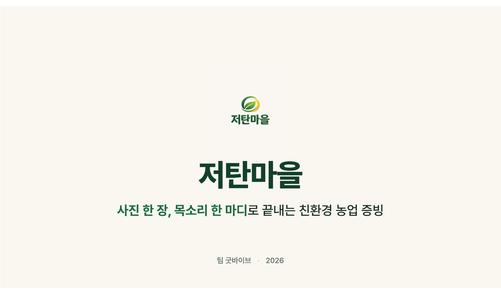
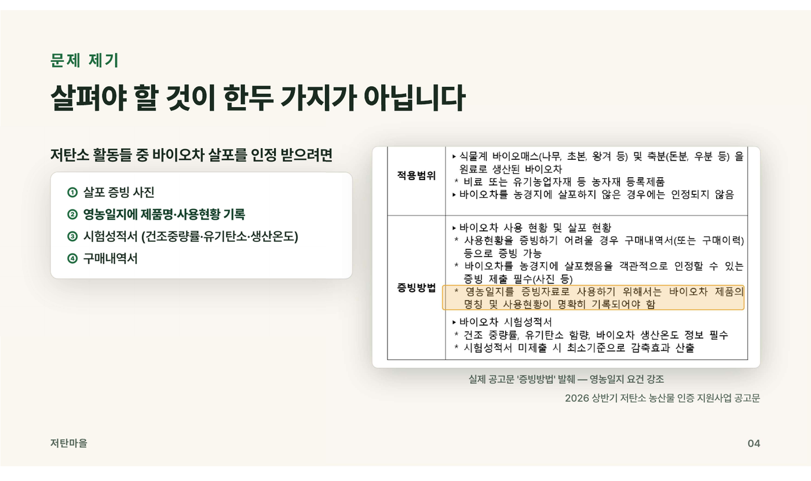
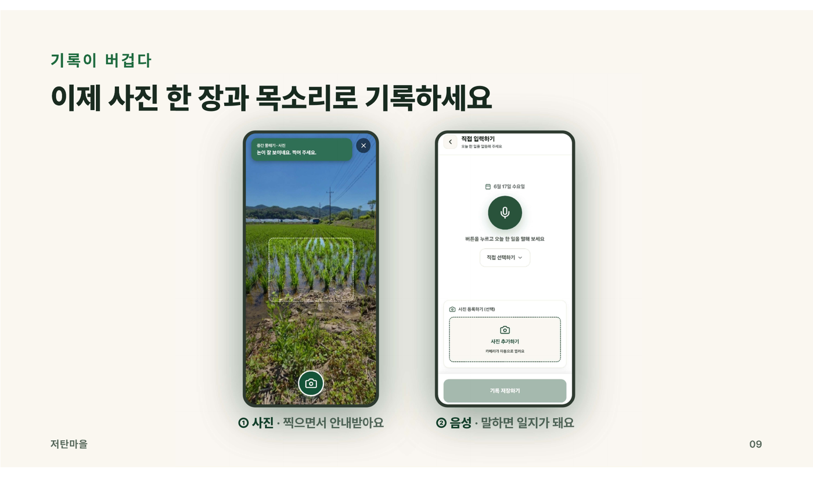
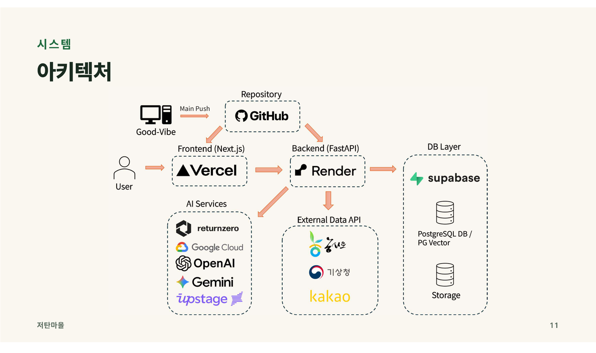
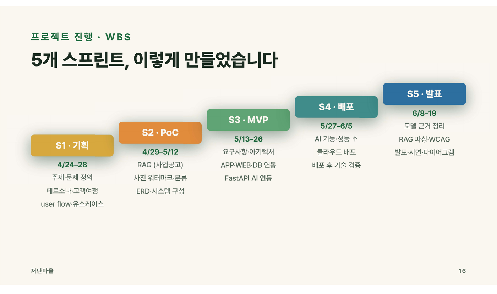
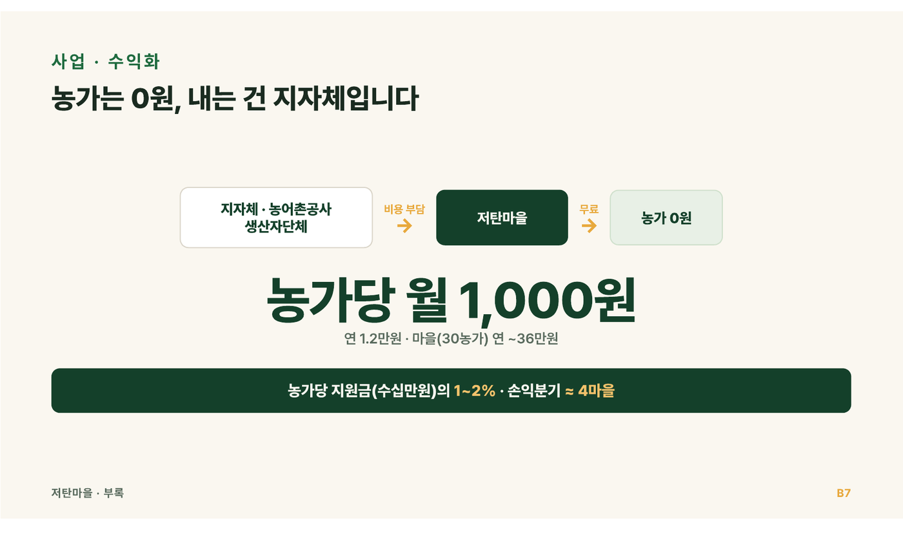
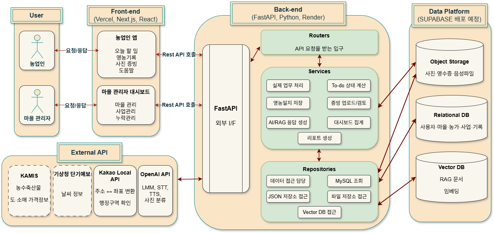

# 저탄마을 / Locaville

> 삼정KPMG Future Academy 8기 Final Project - Team GoodVibe

저탄마을은 저탄소 농업 프로그램의 `오늘 할 일` 생성, 영농일지 작성, 사진 증빙, 이장님 검토 흐름을 하나로 묶은 모바일 + 웹 시연 서비스입니다.  
농업인은 휴대폰에서 음성/사진으로 기록하고, 이장님은 웹 대시보드에서 마을 단위 이행 현황을 확인합니다.

## 바로 보기

| 서비스 | 링크 |
| --- | --- |
| 농업인 모바일 앱 | [https://locavilleapp.vercel.app/](https://locavilleapp.vercel.app/) |
| 이장님 웹 대시보드 | [https://locaville.vercel.app/dashboard](https://locaville.vercel.app/dashboard) |

- [최종 발표자료 PDF](./docs/presentation/발표자료.pdf)
- [최종 발표자료 HTML](./docs/presentation/저탄마을_발표자료.html)
- [발표 스크립트 v3](./docs/presentation/저탄마을_발표_스크립트_v3.md)
- [팀 기여 정리](./docs/portfolio/team-contributions.md)
- [산출물 인덱스](./docs/portfolio/artifact-index.md)
- [서비스 소스코드](./locaville)

## 발표자료 하이라이트

| 서비스 콘셉트 | 현장 문제 |
| --- | --- |
|  |  |

| 모바일 기록 흐름 | 시스템 아키텍처 |
| --- | --- |
|  |  |

| 프로젝트 진행 | 사업 모델 |
| --- | --- |
|  |  |

## 문제 정의

저탄소 농업 사업은 일정, 활동, 증빙 조건이 복잡합니다. 특히 고령 농업인은 영농일지와 사진 증빙을 제때 남기기 어렵고, 이장님은 누가 늦고 어떤 증빙이 부족한지 한눈에 보기 어렵습니다.

저탄마을은 이 과정을 다음 한 문장으로 줄였습니다.

> "오늘 무엇을 해야 하는지 알려주고, 사진과 목소리로 남기면, 이장님이 바로 확인한다."

## 핵심 기능

| 영역 | 구현 내용 |
| --- | --- |
| 농업인 앱 | 오늘 할 일, AI 오늘 한마디, 음성 기반 영농일지, 사진 첨부, 도움말 챗, 도우미 모드 |
| 라이브 사진 코칭 | 촬영 전 2초 간격 Vision 분석, 한국어 안내, Chirp 3 HD TTS, 영수증/현장사진/이수증 분기 |
| 이장님 대시보드 | 우선 확인 농가, KPI, 최근 증빙, 마을 일정, 재촬영 요청, 도우미 pair 관리 |
| 관리자 웹 | 마을, 사업, 활동, 농가 등록 및 사업 정책 관리 |
| 백엔드 | FastAPI, PostgreSQL, RAG, STT/TTS, Vision 판정, 워터마크, 역지오코딩, 데모 seed |
| 데이터 원칙 | DB가 source of truth, AI는 advisory, 사용자가 누른 경우만 저장 |

## 시스템 구성



```text
농업인 앱 app_user       이장님 웹 web_user       관리자 웹 web_admin
        |                       |                         |
        +-----------------------+-------------------------+
                                |
                         FastAPI backend
                                |
           PostgreSQL + Supabase Storage + 외부 API + AI/RAG
```

핵심 도메인은 사용자/마을 -> 사업/활동 -> To-do -> 영농일지/증빙 -> 검토/알림 순서로 흐릅니다.


## 기술 스택

| 구분 | 기술 |
| --- | --- |
| Backend | FastAPI, Python, Uvicorn, psycopg, PostgreSQL |
| Frontend | Next.js 16, React 19, TypeScript 5.7 |
| AI | OpenAI Chat/Vision, Gemini 2.5 flash-lite, Returnzero STT, Google Chirp 3 HD TTS |
| RAG | Chroma / LangChain, 정책 문서 Q&A 전용 |
| Image | Pillow 워터마크, OpenCV Laplacian 블러 검사 |
| External API | Kakao Local, 기상청 단기예보, 농촌진흥청 농사로 |
| Deploy | Vercel frontend, Render backend 기준 |

## 프로젝트 구조

```text
.
├── docs/
│   ├── presentation/          # 최종 발표자료와 발표 스크립트
│   └── portfolio/             # 팀 역할, 산출물 인덱스, agent 인수인계
├── locaville/
│   ├── backend/               # FastAPI + PostgreSQL + AI/RAG
│   ├── app_user/              # 농업인 모바일 앱
│   ├── web_user/              # 이장님 대시보드
│   ├── web_admin/             # 관리자 웹
│   ├── library/               # locaville 공용 Python 패키지
│   └── docs/                  # 요구사항, 아키텍처, 테스트, 데모 문서
└── render.yaml                # Render backend 배포 참고 설정
```

## 실행 방법

### Backend

```powershell
cd locaville\backend
python -m venv .venv
.\.venv\Scripts\python -m pip install -e ..\library
.\.venv\Scripts\python -m pip install -r requirements.txt
.\.venv\Scripts\python -m uvicorn app.main:app --reload --host 0.0.0.0 --port 8000
```

### 농업인 앱

```bash
cd locaville/app_user
pnpm install
pnpm dev
```

### 이장님 웹

```bash
cd locaville/web_user
pnpm install
pnpm dev -- -p 3001
```

### 관리자 웹

```bash
cd locaville/web_admin
pnpm install
pnpm dev -- -p 3002
```

## 환경변수

실제 `.env` 파일은 커밋하지 않습니다. 필요한 값은 각 앱의 `.env.example` 또는 backend의 `.env.production.example`을 참고합니다.

주요 backend secret:

- `OPENAI_API_KEY`
- `GEMINI_API_KEY`
- `GOOGLE_TTS_API_KEY`
- `RETURNZERO_CLIENT_ID`, `RETURNZERO_CLIENT_SECRET`
- `KAKAO_REST_API_KEY`
- `DATA_GO_KR_SERVICEKEY`
- `NONGSARO_API_KEY`
- `DATABASE_URL`

프론트엔드에는 `NEXT_PUBLIC_API_BASE_URL`처럼 공개 가능한 값만 둡니다.

## 팀 기여

| 이름 | 주요 기여 |
| --- | --- |
| 박찬호 | 팀장, 문제정의, 현장 리서치, 발표, UX 흐름, 프론트엔드, AI 연동, 백엔드 구현 |
| 강창희 | 백엔드, PostgreSQL/DB 모델링, RAG, API 구조, 데이터 흐름 정리 |
| 박순선 | QA, 테스트/산출물 관리, UX 점검, 요구사항 및 발표 보조 산출물 정리 |
| 이동현 | 초기 기획 및 문제정의 보조 |

상세 내용은 [팀 기여 정리](./docs/portfolio/team-contributions.md)에 정리했습니다.

## 검증

```bash
cd locaville/backend
python -m compileall app
```

```bash
cd locaville/app_user && pnpm exec tsc --noEmit
cd locaville/web_user && pnpm exec tsc --noEmit
cd locaville/web_admin && pnpm exec tsc --noEmit
```

## 데모 기준

| 구분 | 값 |
| --- | --- |
| 마을 | `LOCALVILLE01` 서호마을 |
| 그룹 | `1000000102` 서호마을작목반 |
| 사업 | `KK26A001` 2026 저탄소 농업 프로그램 시범사업 |
| 대표 농업인 | `farmer_id=kimys68` 김영수 |
| 도우미 데모 | 박정호 recipient / 김영수 helper |

## 포인트

- 단순 챗봇이 아니라 정책 문서, 일정, 증빙, 검토를 연결한 end-to-end 서비스
- 고령 사용자 기준의 모바일 UX와 마을 운영자 웹을 동시에 설계
- AI는 자동 결정자가 아니라 기록 보조, 사진 코칭, 정책 Q&A에 제한
- 데이터 권위는 DB에 두고, 감사 가능한 ID 체계와 증빙 흐름을 구현
- 발표자료, 스크립트, 기술 문서, 테스트 문서를 함께 보존해 프로젝트 맥락을 추적 가능하게 구성
