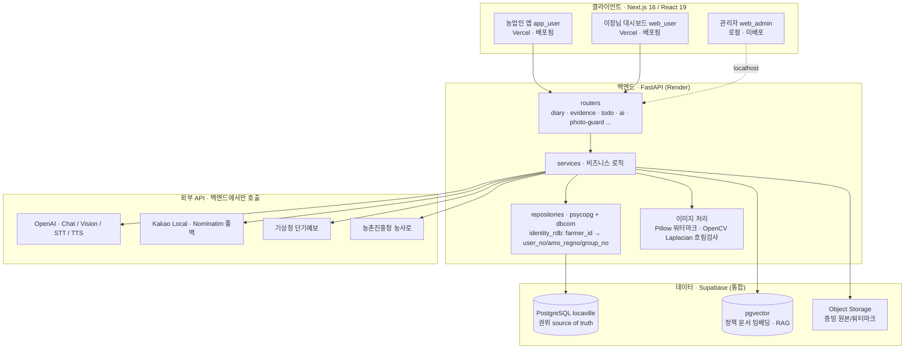
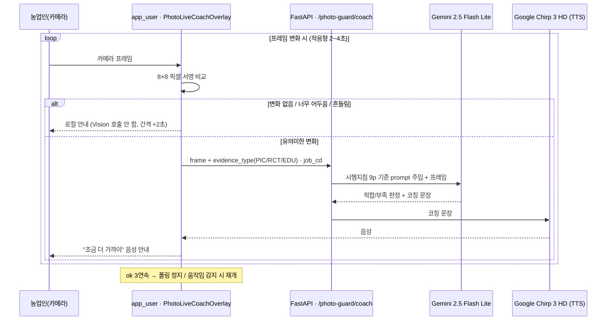
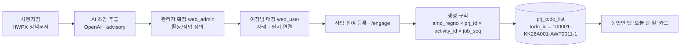
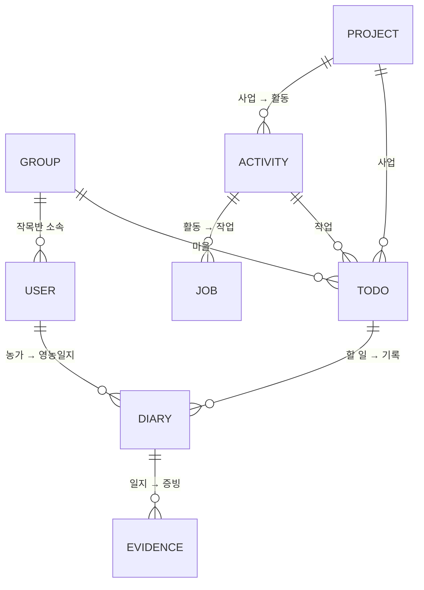
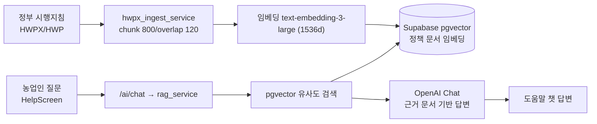
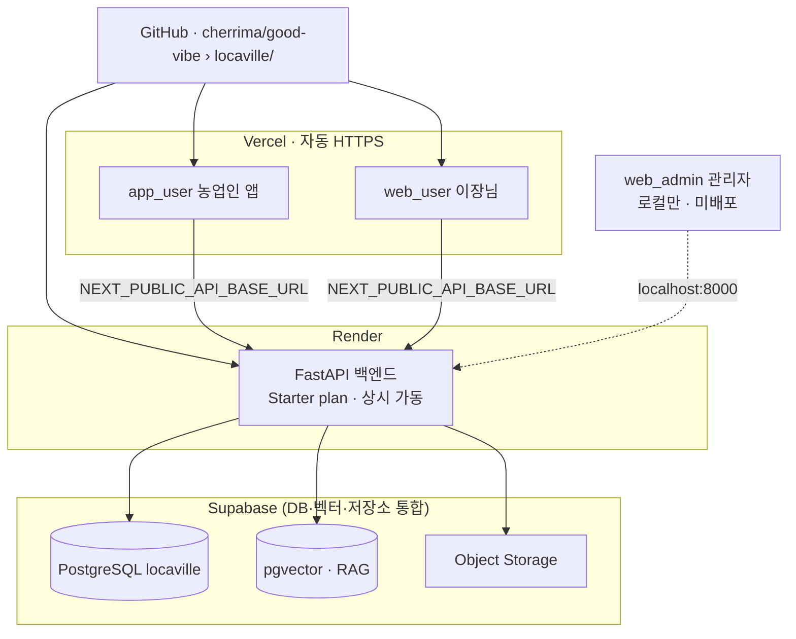
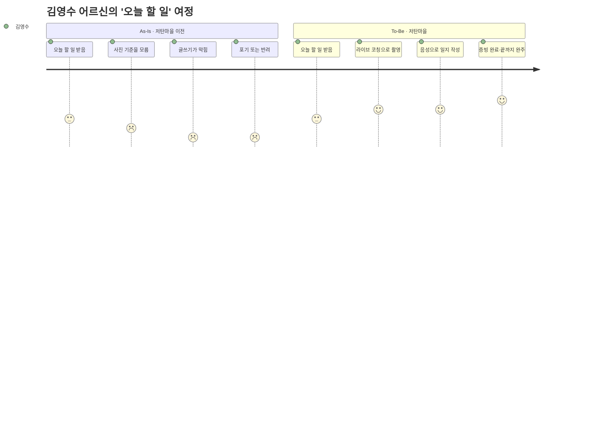

# 저탄마을 발표 스크립트 v3 (본편 13장 + 부록)
> 팀 합의 재구성: As-Is/To-Be 통합 · 지침→기록→디지털 순서 · 곱셈식 제거(간략 ERD) · 설계 철학 슬라이드 제거("확정은 사람이"는 ERD·도우미 슬라이드로 흡수) · ESG 슬라이드 제거(알맹이·기원스토리로 유지) · 시연 직후 기술 전진 배치 · 임팩트는 벤치마크+비전으로 분산.

**팔레트:** bg `#FAF7F0` · ink `#1A2B20` · green-deep `#14402A` · green-mid `#1F6B3F` · green-tint `#E8F0E6` · gold `#E8A93D` · muted `#5A6B5E` · line `#D9D4C8` · Pretendard · 16:9

**본편 흐름:**

| # | 슬라이드 | 구간 |
|---|---|---|
| S1 | 훅 — 매일 기록, 쓰시나요? | 여는 말 |
| S2 | 문제 — 영농일지 = 증빙 | 문제 |
| S3 | 리빌 — 사진 한 장, 목소리 한 마디 | 해결 미리보기 |
| S4 | 현장 리서치 | 신뢰 |
| S5 | As-Is → To-Be 통합 (지침·기록·디지털) | 문제→해결 |
| S6 | 서비스 흐름 (운영자·이장님·농업인) | 구조 |
| S7 | 시연 (2분) | 증명 |
| S8 | to-do 산정 — 간략 ERD (+확정은 사람이) | 핵심 구조 |
| S9 | 라이브 코칭 기술 흐름 | 진짜 만들었다 ① |
| S10 | 도우미 · 이장님 확인 | 진짜 만들었다 ② + 거버넌스 |
| S11 | 모델 선택 + 벤치마크 | 데이터로 골랐다 |
| S12 | 팀 | 팀 |
| S13 | 비전 · 클로징 (감소 목표 + 북엔드) | 닫는 말 |

---

## S1. 훅 — 매일 기록, 쓰시나요? (여는 말 / 0:30)

**화면:** 큰 질문 한 줄 "매일 기록, 쓰시나요?" / 아래 작게 "굿바이브 · 박찬호". 여백 많게.

**스크립트:**
> 여러분, 매일 뭔가를 기록하시나요? 일기든 가계부든 운동이든요. 대부분 작심삼일이죠. (한 박자) 그런데 이 기록을 안 하면, 받을 돈을 못 받는 분들이 있습니다. 농업인입니다.

**메모:** "회고"→"기록"으로. 청중 공감(나도 기록 실패)에서 농업인으로 전환. 클로징과 북엔드.

## S2. 문제 — 영농일지는 증빙이다 (문제 / 0:45)

**화면:** "이 기록은 일기가 아닙니다. 친환경 지원사업의 **증빙**입니다." / 누락 = 불이익. / `기록 → 증빙 → 지원사업` 한 줄 흐름. / 보도 인용 작게 "영농일지가 '숙제'로 여겨진다".

**스크립트:**
> 농업인이 쓰는 영농일지는 일기가 아니에요. 정부 친환경 지원사업의 증빙입니다. 기록과 증빙이 빠지면 받을 돈을 못 받아요. 그런데 현장에선 이게 '숙제'처럼 느껴진다고 합니다. 받아야 할 지원이, 기록 때문에 막히는 거죠.

**메모:** 증빙 = 돈을 분명히. 감정(숙제)과 이해관계(돈)를 한 슬라이드에.

## S3. 리빌 — 사진 한 장, 목소리 한 마디 (해결 미리보기 / 0:40)

**화면:** "영농일지와 증빙을, **사진 한 장과 목소리 한 마디**로." + '오늘 할 일' 카드(중간 물떼기 · 1번 논 · 마감 7/11 · 증빙: 작업 사진 필요 · "작업한 곳이 잘 보이게 찍어주세요" · [사진 찍고 완료하기]).

**스크립트:**
> 저희 저탄마을은 이 부담을, 사진 한 장과 목소리 한 마디로 끝냅니다. 어르신은 '오늘 할 일' 카드를 받고, 안내대로 사진을 찍고 완료만 누르면 돼요. 글을 쓸 필요가 없습니다.

**메모:** 제품 약속 한 줄 + 실제 카드 보여주기. 데모(S7)의 예고편.

## S4. 현장 리서치 (신뢰 / 0:50)

**화면:** "전화기를 들고 현장을 확인했습니다" / 이장님 인용 "저탄소 농업프로그램? 그런 게 있는 줄도 몰랐는데…" / 복지센터 인용 "디지털 격차가 심해서, 기록 보조 도우미가 따로 있어요." / 하단 "현장에서, 사람에게서 시작했습니다."

**스크립트:**
> 저희는 책상이 아니라 전화기를 들고 시작했어요. 팀원 고향 이장님은 "저탄소 사업? 그런 게 있는 줄도 몰랐다"고 하셨고요. 동네 복지센터에선 "디지털 격차가 심해서, 기록을 대신 도와주는 도우미가 따로 있다"고 했습니다. 문제는 현장에, 사람한테 있었어요.

**메모:** 진정성·신뢰. '기록 도우미' 복선 → 뒤 S10에서 회수.

## S5. As-Is → To-Be 통합 (문제→해결 / 1:10) 〔재구성 — As-Is 슬라이드 흡수 · 지침→기록→디지털〕

**화면:** 좌 **As-Is(현장의 어려움)** → 우 **To-Be(저탄마을의 해결)**. 3행, 가운데(기록) 행을 가장 크게(1+강조+1 비대칭).
- **지침이 어렵다** → 지침에서 '할 일'을 추출해 전달 *(개인에겐 '오늘 할 일'만)*
- **기록이 버겁다** → **사진 라이브 코칭 + 음성 인식** *(찍으면서 안내받고, 말하면 일지가 된다)* ★강조
- **디지털이 낯설다** → 이장님·이웃·기록 도우미가 함께 *(정말 어려운 분은 도우미가 대신)*

**스크립트:**
> 현장에서 세 가지가 보였어요. 첫째, 지침이 어렵다. 수십 페이지를 어르신이 다 읽을 순 없죠. 그래서 저희가 지침에서 할 일을 뽑아, 개인에겐 '오늘 할 일'만 보냅니다. 둘째, 이게 핵심인데, 기록이 버겁다. 사진은 찍으면서 기준을 안내받고, 말하면 그게 그대로 일지가 됩니다. 셋째, 디지털이 낯설다. 정말 어려운 분은 이장님·이웃·기록 도우미가 곁에서 대신 남깁니다. 한 명도 빠지지 않게요.

**메모:** **이 세 약속이 덱 후반에서 회수됨** — 지침→S8 ERD, 기록→S9 코칭, 디지털→S10 도우미. 가운데(기록) 행을 크게. 마지막 '디지털→도우미'로 따뜻하게(포용) 착지.

## S6. 서비스 흐름 — 세 사람, 하나의 카드 (구조 / 0:45)

**화면:** `운영자(세팅: 사업·활동·작업 정의)` → `이장님(매칭: 마을 농가·사업 연결)` → `농업인('오늘 할 일' 한 장 도착 · 기준·일정 붙은 카드)`. 헤드라인 "복잡한 지침이, 단 하나의 '오늘 할 일'로".

**스크립트:**
> 그 '오늘 할 일'은 어떻게 만들어질까요. 세 사람이 움직입니다. 운영자가 사업과 작업을 정의하고, 이장님이 우리 마을 농가를 연결하고요. 그러면 농업인한테는 기준과 일정이 붙은 카드 한 장이 도착합니다. 복잡한 지침이, 딱 하나의 오늘 할 일로요.

**메모:** 데모 전 역할 오리엔테이션. 이장님을 여기서 소개 → 데모(S7)·확인(S10)에서 재등장.

## S7. 시연 (증명 / 2:00)

**화면:** "직접 보시죠" + 볼 포인트 3개(① 사진을 어떻게 찍는지 ② 이장님이 어떻게 확인하는지 ③ 어르신이 얼마나 적게 입력하는지) + 시연 영상 자리(약 2:00).

**스크립트:**
> 말보다 보시는 게 빠르겠죠. 2분만 보겠습니다. 세 가지만 봐주세요. 사진을 어떻게 찍는지, 이장님이 어떻게 확인하는지, 그리고 어르신이 얼마나 적게 입력하는지. (영상 시작 전 한 마디) 이건 실제로 돌아가는 저희 앱입니다.

**메모:** 실제 녹화 영상. "실제로 돌아가는 앱" 한 마디로 진위 의심 선제 차단.

## S8. to-do 산정 — 간략 ERD (핵심 구조 / 1:10) 〔재구성 — 곱셈식 제거 · "확정은 사람이" 흡수〕

**화면:** 간략 ERD/흐름.
- 상단 3단계: **AI가 읽는다**(초안만) → **사람이 다듬는다**(관리자: 작업 기준 / 이장님: 참여 농가) → **시스템이 만든다**
- 가운데 산정 법칙: **작업 기준 × 참여 농가 → 농가별 to do**. 간략 엔티티(사업→활동→작업 기준 / 참여단체→농가)
- 하단 두 줄: ① 가치 — *"사람이 엑셀로 짜면 며칠, 우리는 버튼 한 번"* ② 원칙(골드) — **"AI는 초안만, 확정은 사람이."**

**스크립트:**
> 방금 보신 '오늘 할 일', 어떻게 만들어지는지 데이터로 보여드릴게요. 세 단계예요. 먼저 AI가 수십 페이지짜리 시행지침을 읽고 할 일 초안을 뽑습니다. 딱 초안까지예요. 그다음 사람이 다듬습니다. 관리자가 사업·활동·작업 기준을 확정하고, 이장님이 우리 마을의 참여 농가와 필지를 매칭하고요. 그러면 마지막으로 시스템이 규칙대로 생성합니다. 작업 기준 곱하기 참여 농가, 이 곱연산이 농가별 할 일을 한 번에 만들어내요. 사람이 엑셀로 짜면 며칠 걸릴 걸 버튼 한 번에 끝냅니다.
> 그리고 이 곱연산은 그냥 비유가 아니라, 키 설계에 그대로 들어가 있어요. 할 일 하나하나에 경영체·사업·활동·순번이 합쳐진 ID가 붙습니다. 그래서 ID만 봐도 누가 어떤 사업의 어떤 작업을 했는지 역추적이 돼요. 지원금이 걸린 서비스라, 이 추적 가능성이 핵심이거든요.
> 원칙 하나만 기억해 주세요. 자동으로 저장되는 건 없습니다. 사람이 명시적으로 누를 때만 DB에 들어가요. AI는 초안만, 확정은 사람이 합니다.

**메모:** 10×2×4 식 제거 → 간략 ERD(부록 A2보다 단순하게 5~6박스). 철학 슬라이드 대신 마지막 한 줄로 흡수. 합성키 상세는 부록 A2.

## S9. 라이브 코칭 — 진짜 어떻게 도는가 (진짜 만들었다 ① / 1:30)

**화면:** `카메라 프레임` → `앱 오버레이(8×8 픽셀 서명 비교 — 변할 때만 호출)` → `/photo-guard/coach` → `Vision(Gemini Flash Lite · 지침 기준 prompt)` → `TTS(Chirp 3 HD)` → "조금 더 가까이" 음성. 하단: 정지 화면이면 미호출, ok 3연속이면 폴링 정지 → 호출·비용 ↓.

**스크립트:**
> "이거 진짜 직접 만든 거 맞아?" — 시연이 매끄러우면 그런 생각 드실 수 있어요. 그래서 사진 코칭이 실제로 어떻게 도는지 한 장만 열어볼게요.
> 핵심은 '언제 AI를 부르느냐'예요. 3초마다 무조건 부르면 비용이 폭발하거든요. 그래서 저흰 카메라 화면을 8×8 픽셀짜리 아주 작은 서명으로 줄여서, 직전 화면이랑 계속 비교합니다. 변화가 거의 없으면 — 어르신이 화면을 가만히 들고 계시면 — Vision 모델을 아예 안 불러요. 로컬에서 "조금만 더 가까이" 같은 안내만 하고, 호출 간격을 2초에서 4초까지 늘립니다. 화면이 확 바뀌는 순간에만 서버를 부르고요.
> 그리고 서버가 그냥 "사진 괜찮아?"라고 묻는 게 아니에요. 그 작업의 증빙 기준 — 이게 작업 사진인지 영수증인지, 어떤 작업인지 — 을 시행지침에서 뽑아서 프롬프트에 같이 넣습니다. 그래서 막연한 코칭이 아니라, 정책 기준에 맞는지를 판정해요. 모델은 빠르고 싼 걸로 골랐고, 결과는 음성으로 바로 돌려줍니다.
> 마지막으로, 잘 찍혔다는 판정이 세 번 연속 나오면 폴링을 아예 멈춰요. 어르신이 또 움직이면 그때 다시 시작하고요.
> 정리하면 — 어르신은 그냥 카메라를 들고 안내만 따르면 되고, 저흰 꼭 필요할 때만 AI를 부르니 비용이 낮습니다. 화면이 멈춰 있으면 돈이 안 나가는 구조예요.

**메모:** 진위 증명 ①. 비전문가용 so-what("어르신은 버튼만, 비용 낮음")을 꼭 한 줄. 시각적으로 멋지게.

## S10. 도우미 · 이장님 확인 (진짜 만들었다 ② + 거버넌스 / 1:05)

**화면:** 두 흐름.
- (좌·포용) 정말 어려운 분 → **이장님·이웃·기록 도우미가 대신 사진·음성** 남김
- (우·거버넌스) 모든 증빙 → **이장님 재확인 → 확정** *(AI가 혼자 결정 안 함)*
- 하단: "한 명도 빠지지 않게 · **확정은 사람이**"

**스크립트:**
> 두 가지를 더 보여드릴게요. 둘 다 시연만으론 안 보이는 부분이에요.
> 먼저 포용입니다. 앱을 정말 못 쓰는 어르신은요? 이장님이나 이웃, 또는 기록 도우미가 곁에서 대신 사진과 음성을 남깁니다. 사실 시행지침에도 '이행증빙도우미'라는 역할이 명시돼 있어요. 저흰 그걸 시스템으로 받아낸 거고요. 못 쓰는 사람을 빼는 게 아니라, 단계적으로 끌어안습니다.
> 두 번째는 거버넌스예요. 사진 판정에서 저희가 제일 신경 쓴 건 사실 정확도가 아니라, '찍으면 안 되는 걸 통과시키는 비율'이었어요. 그걸 0%로 맞춘 모델을 골랐고요. 그런데 그것만으론 부족하죠. 그래서 애매한 증빙은 이장님이 한 번 더 확인하고 확정합니다. AI가 혼자 지원금 판단을 내리지 않아요. AI는 초안, 확정은 사람. 이게 저희가 책임 있는 AI를 구현한 방식입니다.

**메모:** 디지털 약속(S5) 회수 + 거버넌스를 *행동으로*(추상 격언 X). false_OK 0%의 의미가 여기서 살아남.

## S11. 모델 선택 + 벤치마크 — 데이터로 골랐다 (데이터로 골랐다 / 1:15)

**화면:** 위 배너 **토대 — 데이터 모델·합성키(모든 할 일이 사람·사업·활동·작업 키 하나로 역추적)**. 그 위에 AI 3개:
- 음성인식 STT **4.66%** (기존 대비 약 ¼ · 야외·고령 벤치)
- 화면 판정 Vision **91.3%** (위험통과 0% · 23장 평가셋)
- 음성 안내 TTS **1위** (3인 블라인드)
- 한 줄: *앱 안에 3모델 비교 모드 + CSV 로그로 직접 골랐다.* 상세 부록 A4·A5.

**스크립트:**
> AI는 그냥 가져다 쓰지 않았어요. 작업마다 데이터로 골랐습니다.
> 음성인식은 바람·경운기 소음에 어르신 사투리까지 섞인 실제 조건으로 여러 모델을 돌려서, 한국어 특화 모델이 오차율 4.66%로 제일 낮은 걸 확인하고 골랐어요. 기존 대비 4분의 1입니다.
> 사진 판정은 23장짜리 평가셋을 직접 만들어서 봤는데, 정확도만 본 게 아니라 오류를 두 종류로 나눠 봤어요. 통과시키면 안 되는 걸 통과시키는 오류, 그리고 반대로 멀쩡한 걸 반려하는 오류. 앞엣것은 곧장 지원금 사고로 이어지니까 0%인 모델을, 뒤엣것까지 같이 보면서 골랐습니다.
> 음성 안내는 어르신께 또렷하게 들리는지 셋이 직접 블라인드로 듣고 정했고요.
> 글로 답하는 LLM은 아예 앱 안에 세 모델을 나란히 비교하는 화면을 만들어서, 어떤 답이 더 나은지 고른 기록을 CSV 로그로 남기고 결정했습니다.
> 그래서 한 회사에 묶이지 않고 구글·업스테이지·오픈AI·리턴제로로 분산돼 있어요. (한 박자) 이런 비교 도구나, 아까 보신 키 설계 같은 건 — 베껴서는 못 만드는 것들입니다.

**메모:** 벤치마크 숫자 = 기술 임팩트(별도 임팩트 슬라이드 불필요). "앱내 비교모드·합성키"로 진위 의심 못박기. 비전문가용: "데이터로 신중히 골랐다".

## S12. 팀 굿바이브 (팀 / 0:30)

**화면:** 4명 역할(박찬호 기획·프론트·AI 연동·백엔드 / 강창희 백엔드·DB·RAG / 박순선 QA·산출물·UX / 이동현 초기 기획·문제정의 보조) + 헤드라인 "어르신이 실제로 쓸 수 있나" + 하단 WCAG 2.2 참고 접근성 점검(글씨·버튼·색 대비).

**스크립트:**
> 저희 팀 굿바이브입니다. 만드는 내내 기준은 하나였어요. "어르신이 실제로 쓸 수 있나." 그래서 글씨, 버튼 크기, 색 대비까지 접근성 기준으로 점검했습니다.

**메모:** 짧게. 팀 다음에 비전으로 닫음(조직도로 끝내지 않음).

## S13. 비전 · 클로징 (닫는 말 / 0:50)

**화면:** "우리가 줄이려는 것" — **재촬영 · 반려 · 포기** (목표치, *시범에서 측정해 확정*). 하단 북엔드: "매일 기록, 쓰시나요? **이제, 사진 한 장과 목소리 한 마디로.**"

**스크립트:**
> 저희가 만들고 싶은 변화는 분명해요. 어르신이 사진을 다시 찍는 횟수, 증빙이 반려되는 횟수, 그리고 기록 때문에 사업을 포기하는 경우. 이 셋을 줄이는 겁니다. 시범 마을에서 정확히 측정해서 목표를 확정할 거고요. 처음에 여쭤봤죠. 매일 기록 쓰시냐고. 이제 농업인은, 사진 한 장과 목소리 한 마디로 합니다. 감사합니다.

**메모:** **목표치(실적 아님)** — "줄였다" 금지, "줄이려는 것·시범에서 측정". 북엔드로 감정 닫기. 비즈니스 한 줄 옵션: "마을 단위로, 운영기관이 끝까지 관리하게".

---
# 부록 (Q&A 백업 슬라이드 — 발표 시간에 포함하지 않음)

> **운영 원칙:** 본편에서 펼치지 않는다. 질문이 들어왔을 때만, "한 질문 = 한 슬라이드"로 띄운다.
> 부록은 두 묶음. **묶음 1(기술)** = IT 컨설턴트·대표님용. **묶음 2(컨설팅·ESG)** = 현대경제연구원·KPMG ESG 부장님용.
> 발표자는 첫 질문을 듣고 어느 묶음으로 갈지 즉시 판단할 것.

## 부록 인덱스 (한 장으로 — 질문 받자마자 "어디에 있는지" 보여주는 용도)
- **기술:** A1 전체 아키텍처 · A2 할 일 생성 파이프라인 · A2-보조 데이터 모델 설계 · A3 RAG 파이프라인 · A4 음성인식(STT) · A5 모델·TTS 선택 · A6 DevOps·인프라 · A7 보안·개인정보 · A8 구현 범위(기능 스코프)
- **컨설팅·ESG·사업:** B1 ESG · B2 AX As-Is→To-Be · B2-보조 여정(감정선) · B3 시장 · B3+ 확장 3축(사업·신뢰·데이터) · B4 수익화 · B5 비용·단위경제 · B6 마케팅·GTM · B7 리스크 · B8 WBS·일정 · B9 로드맵(Now/Next/Later) · B10 경쟁 벤치마크

## Q&A 답변 분담 (15분 대비 — 누가 받을지 미리 정해둘 것)
- **박찬호(기획·발표):** 문제정의·현장리서치·ESG·AX·시장·마케팅·수익화 (B 묶음 + 본편)
- **강창희(백엔드·AI):** 아키텍처·RAG·STT/TTS·비용·확장·보안 (A 묶음 + B5)
- **박순선(QA·산출물):** 접근성·테스트·WBS·시연 안정성 (A7·B8)
- **공통 규칙:** 모르는 건 지어내지 말 것 → "그 부분은 아직, 다만 방향은 ___입니다"로 답. 컨설턴트 심사위원은 *솔직 + 방향 제시*를 높게 봄.

---

# 묶음 1 — 기술 (IT 컨설턴트·대표님용)

## A1. 전체 시스템 아키텍처
3주체 클라이언트(Next.js 16/React 19) → 공통 FastAPI 백엔드 → Supabase(PostgreSQL + pgvector + Object Storage). 외부 API(OpenAI·Kakao·기상청·농사로)는 **백엔드에서만** 호출하고, 프론트엔드는 비밀키를 보관하지 않음. **DB가 권위 source, AI는 advisory.** *벡터 저장소는 Chroma에서 Supabase pgvector로 이관 — 관계형·벡터·파일을 한 곳(Supabase)으로 통합.*

**심사 질문 대비:** "호스팅?" → 프론트 Vercel, 백엔드 Render, DB·벡터·저장소 모두 Supabase. "외부 AI 의존도?" → **단일 벤더 종속 아님. 작업별로 Google(Gemini·Chirp)·Upstage(Solar)·OpenAI(nano·mini)·RTZR(STT)로 분산 적용**(A4·A5). "기록 보존?" → 일지·증빙·To-do의 권위 source는 항상 DB, AI는 보조.

### A1-보조. 라이브 사진 코칭 루프 (실시간 AI — 시연의 핵심)

**핵심:** ① 사진 기준이 시행지침의 evidence_type × job_cd에서 prompt로 주입됨 → "막연한 코칭"이 아니라 "정책 기준에 맞춰" 코칭. ② **3초 고정 폴링이 아니라 픽셀 변화 기반 적응형** — 정지 화면이면 Vision을 아예 안 부르고, ok 3연속이면 정지 → 호출 수가 적고 비용이 낮음(B5).

## A2. 할 일 생성 파이프라인 (본편 S8의 데이터 흐름)
`todo_id`의 합성키 구조가 곧 본편의 곱연산입니다 — `amo_regno × prj_id × activity_id × job_seq`.

**원칙:** DB가 권위, AI는 초안만, 자동 저장 없음(명시 클릭만 INSERT).

**심사 질문 대비:** "AI 오답은 어디서 걸리나요?" → 관리자 확정 단계(사람). "추적 가능성?" → 모든 할 일이 `todo_id` 합성키로 사업·활동·작업까지 역추적.

## A2-보조. 데이터 모델 설계 (가장 공들인 토대 · 강창희)
"AI는 초안만, 시스템은 추적 가능하게"(S8)와 곱연산(S8)을 *실제로 가능하게 만드는* 설계. 핵심은 **합성키로 모든 기록을 역추적**하는 구조.

*개념 수준(실제 컬럼은 spec 문서). TODO는 마을·사업·작업의 교차점 = 곱연산의 실체.*

**설계 포인트 (질문 시 펼칠 것):**
- **합성키 체계:** `todo_id = amo_regno-prj_id-activity_id-job_seq`, `diary_id = user_no-yyyymmdd-exec_no`, `evidence_id = diary_id-seq`. → ID만 봐도 경영체·사업·활동·날짜까지 역추적. **곱연산은 비유가 아니라 키 설계 그 자체.**
- **DBMS 중립 계층:** `dbcom.py`가 `DB_SOURCE`로 postgres/mysql 분기 → 벤더 종속 최소화. 이 추상화 덕에 **MySQL → PostgreSQL → Supabase(pgvector 통합)** 마이그레이션이 가능했음.
- **DB 권위 원칙:** 일지·증빙·todo의 source-of-truth는 항상 DB, AI는 advisory. → S8 거버넌스의 *기술적 근거*.
- **identity 정규화:** 프론트는 `farmer_id` 하나로만 다니고 `identity_rdb`가 user_no/amo_regno/group_no로 해석 → 하드코딩·정합성 오류 차단.

**심사 질문 대비:** "데이터 모델을 어떻게 설계했나요?" → 합성키 + 도메인(사업→활동→작업→일지→증빙). "추적 가능성 보장은?" → 키 설계로 강제. "DBMS를 바꾸는 게 어렵지 않았나요?" → 중립 계층 덕에 가능했고 실제로 이관함.

## A3. RAG 파이프라인 (정책 Q&A 전용)
**구현:** 임베딩 `text-embedding-3-large` **1536차원** · `RecursiveCharacterTextSplitter`(청크 800 · overlap 120) · 검색 top-k 4(상한 12) · **MMR λ=0.7**. 근거 없을 때는 하드코딩이 아니라 **system-prompt grounding**으로 추정 답변 차단(실제 안내는 "확인이 안 돼요" 계열).

**원칙:** 정책 Q&A 전용. `/todo`·`computed_status` 계산엔 RAG 미사용(운영원칙 #4) → 지원금 직결 로직과 생성형을 분리. *런타임 벡터 저장소는 Supabase pgvector로 일원화(Chroma는 롤백용 폴백 코드만 잔존).*

**심사 질문 대비:** "왜 pgvector?" → 관계형 DB와 같은 Supabase에서 운영 → 인프라 단순화, 별도 벡터 서버·파일시스템 의존 제거. "환각은?" → 정책 문서 근거 기반 + 권위 로직과 분리. "최신성?" → 지침 갱신 시 재ingest. *[평가셋은 실제 한 것만 기입]*

## A4. 음성인식(STT) — 한국어·야외·고령 조건 벤치마크
**평가 조건:** 야외(바람·경운기·트랙터 소음) + 고령 화자 + 농업 도메인·사투리 발화. 테스트 문장 예: "모심을라고 써레질 했어요", "논에 로타리 쳤어요", "저 고개너머 논에서 했어요", "윗논이에요".

| 모델 | 오류율(WER) | 비고 |
|---|---|---|
| **리턴제로 RTZR** | **4.66%** | 한국어 특화, 야외·도메인에 강함 (최저) |
| NAVER CLOVA Speech | 9.09% | 고유명사 보정 가능 |
| Google | 14.11% | |
| OpenAI (구 벤치 baseline) | 17.27% | 위 수치는 구 모델 기준 |

*출처: RTZR 자체 벤치마크 기준 — 발표 시 "벤더 제공 수치"임을 밝힐 것.* 가격(참고): RTZR 시간당 약 1,000원 / CLOVA 15초당 4원 / OpenAI 분당 약 8원.

**결론:** 한국어 특화 + 야외·고령 조건에 **RTZR가 가장 적합(WER 4.66%)** → **기본 STT로 전환 적용 완료**(`STT_PROVIDER` 기본 `returnzero`, 자격증명 없으면 OpenAI Whisper 폴백). *위 17.27%는 구 OpenAI 모델 기준이므로 "기존 대비"로 표현.*

**심사 질문 대비:** "테스트셋?" → 위 농업 도메인 문장. "수치 출처?" → RTZR 벤치(벤더 기준), 자체 재현은 다음 단계. "지금 뭘 쓰나?" → **RTZR `sommers` 한국어(기본), 폴백 OpenAI Whisper.** "왜 폴백을 두나?" → 자격증명·장애 시에도 음성기록이 끊기지 않게.

## A5. 모델 선택 — 데이터로 골라 적용 (STT·Vision·TTS·LLM)
"AI 전부 OpenAI"가 아니라, **작업별로 벤치마크해 골라 적용 완료.** STT(RTZR)·Vision·TTS·도움말·한마디(nano)·임베딩 모두 적용, 카드·알림 Solar 전용 경로만 다음 단계. (STT는 A4 참조)

### Vision (사진 라이브 코칭 판정) — 실측 평가 N=23
| 모델 | 정확도 | false_OK↓ | false_REJ↓ | $/1k호출 | 평균지연 |
|---|---|---|---|---|---|
| gpt-4.1-mini (기존) | 73.9% | 0.0% | 28.6% | $0.86 | 1818ms |
| gemini-2.5-flash-lite | 78.3% | 11.1% | 14.3% | **$0.11** | 1654ms |
| **gemini-2.5-flash (선택·전환 완료)** | **91.3%** | **0.0%** | 7.1% | $0.39 | 2327ms |

- **false_OK** = 찍으면 안 되는 화면(물 찬 논·실내 등)을 통과 = **컴플라이언스 위험** → 낮을수록 안전
- **false_REJ** = 정상 화면을 거절 = 어르신 "왜 안 찍혀" 답답 → 낮을수록 UX 좋음
- **결론:** gemini-2.5-flash가 정확도 91.3% + 위험통과 0%로 안전·정확 → **판정용으로 전환 완료.** 비용 극단 절감은 flash-lite($0.11, 라이브 코칭 메시지에 사용). 기존 gpt-4.1-mini는 false_REJ 28.6%로 UX 손해라 판정에선 제외. *AI는 조언일 뿐 컴플라이언스 최종결정은 사람(S8).*

### TTS (음성 안내) — 3인 블라인드 청취
평가 기준: 명료도·자연스러움·친근함·**도메인정확도**("3번 필지·고추밭·아홉 시"를 정확히 읽는가). 테스트 문장: "오늘은 3번 필지 고추밭에 친환경 방제를 해 주세요. 오전 아홉 시까지 끝내시면 됩니다."

| 라벨 | 벤더/보이스 | 종합(5점) | 순위 |
|---|---|---|---|
| B | **Google Chirp 3 HD** (ko-KR-Chirp3-HD-Kore) | **3.42** | 1 |
| A | Typecast 한국어 성우 | 2.92 | 2 |
| C | OpenAI tts-1 (sage) | 2.83 | 3 |

- 단가(참고, $/1M자): Google WaveNet $4(최저·캐싱 자유) · OpenAI tts-1 $15 · Chirp 3 HD $30. **전 벤더 캐싱 가능** → B9 TTS 캐시와 결합 시 비용 큰 폭 절감.
- **결론:** 품질은 Chirp 3 HD 1위. 비용 우선이면 WaveNet. 둘 다 캐싱으로 변동비 절감.

### LLM (텍스트 생성: 도움말·주간정보·오늘 한마디·알림) — 앱 내 3모델 비교
**방법:** `web_user` 이장님 대시보드에 **LLM 비교 테스트 모드**를 직접 구현 — 한 화면에서 solar-pro-3 / gpt-4.1-nano / gemini-2.5-flash-lite 출력을 나란히 보고 선택, 결과·선택을 CSV로 로그(`llm_compare_results.csv`·`llm_compare_selections.csv`).

| 용도 | 현재 적용 | 비고 |
|---|---|---|
| 도움말 질문 응답 | **GPT-4.1 mini** | 비교상 nano가 우수 → 교체 후보 |
| 주간 농사정보 요약 | **Solar Pro 3** | |
| 오늘 한마디(이장님) | **GPT-4.1 nano** | 경로 분리 적용(`TODAY_WORD_MODEL`) |
| 카드·알림 문구 | **Solar Pro 3** 셀렉터 | *현재는 한마디(nano) 텍스트 공유 표시, 전용 Solar 경로 분리는 다음 단계* |

- **현재 운영:** STT=RTZR · 도움말=gpt-4.1-mini · 오늘 한마디=gpt-4.1-nano · 주간·카드·알림=Solar Pro 3. 작업별로 OpenAI·Google·Upstage·RTZR 분산. "비교로 고르는 과정 자체를 도구화(앱 내 비교 모드+CSV)"가 핵심.

**종합(현재 적용 라인업):** STT→**RTZR `sommers`**(폴백 OpenAI) · 라이브 코칭→**Gemini Flash Lite** · 사진 판정→**Gemini 2.5 Flash** · 영수증 OCR→**GPT-4.1 mini(Vision)** · TTS→**Google Chirp 3 HD** · 도움말→**GPT-4.1 mini** · 오늘 한마디→**GPT-4.1 nano** · 주간·카드·알림→**Solar Pro 3** · 임베딩→**text-embedding-3-large(1536d)**. 즉 **단일 벤더 종속이 아니라 작업별 최적 선택 + 데이터 근거 + 적용 완료.** (카드·알림 Solar 전용 경로 분리만 다음 단계.)

**심사 질문 대비:** "왜 이 모델?" → 위 표·벤치마크. "직접 평가했나?" → Vision 23장·TTS 3인 블라인드·**LLM은 앱 내 비교 모드로 CSV 로그까지** 남겨 실측. "전부 OpenAI 종속 아닌가?" → 아니오, Google·Upstage·OpenAI·RTZR로 분산. "다 적용됐나?" → **STT·Vision·TTS·LLM·임베딩 모두 적용. 남은 건 카드·알림의 Solar 전용 경로 + 도움말 nano 교체 검토.** "컴플라이언스 안전성?" → false_OK 0% 모델 + 사람 최종확정(S8).

## A6. 배포 토폴로지 · DevOps 〔본편 아님, 여기〕

**솔직한 현재 한계(숨기지 말 것):** ① `web_admin`은 아직 로컬(render.yaml 미포함), ② 라이브 카메라(`getUserMedia`)는 HTTPS(Vercel)에서만 작동. *벡터 저장소를 Supabase pgvector로 옮기면서 백엔드 파일시스템 의존(재기동 시 재인덱싱) 문제는 해소했고, Render는 **Starter 플랜(`render.yaml: plan: starter`)으로 상시 가동**이라 cold start 없음.*

**심사 질문 대비:** "배포 자동화?" → GitHub push 기반 Vercel/Render. "마을 100개로 늘면?" → 백엔드는 인스턴스 확장, 데이터·벡터·저장소는 Supabase에서 일원화 관리 → 주 병목은 OpenAI 비용. 선결 과제는 `web_admin` 배포(백엔드는 Starter로 상향 완료).

## A7. 보안 · 개인정보 (ESG 부장님도 물을 수 있음)
- **비밀키:** 전부 백엔드 `.env`에만. `NEXT_PUBLIC_*`엔 공개 가능한 값만, `OPENAI_API_KEY` 등은 프론트 노출 금지. `/health`에 비밀값 미포함.
- **민감정보:** 농업인 개인정보·필지·사진·음성. 증빙은 **원본 보존 + 기본 노출은 워터마크본**.
- **권한 분리:** 농업인(본인 기록) / 이장님(마을 운영 범위) / 관리자(사업 정책). `farmer_id` 정규화로 프론트 하드코딩 차단.

**심사 질문 대비:** "사진·음성 보호?" → 백엔드 경유·키 분리·워터마크. "이장님이 남의 정보를 어디까지?" → 마을 운영에 필요한 범위로 한정(권한 경계 설명).

## A8. 구현 범위 (기능 스코프 — "이거 다 만든 거 맞아요?"의 답)
**두 개의 앱, 한 시스템.** 요구사항정의서 V0.13(QA 반영, 2026.05) 기준 100+ 요구사항, 다수 *개발완료*. 본편은 이 중 *어르신의 한 흐름*만 보여줌.

**WEB(이장님·관리자) — 6 영역:**
- 가입·**본인인증**·로그인(권한 분리) / 대시보드(주민·이행률·미완료) / **주민·필지 관리**(농가-경영체-필지 관계) / **사업·일정 관리**(일정 템플릿 → **농가별 To-do 자동 생성·재계산**) / 영농일지·**증빙 검토**(검토 상태·**영수증 OCR**) / 마을·단체·**알림 발송**·**마을 이행 리포트(PDF)**·**제출 ZIP 패키지**

**APP(농업인) — 5 영역:**
- 홈(날씨·오늘 할 일) / **대화 기록**(음성 STT → 영농일지 + TTS 쉬운 안내) / **사진 증빙**(촬영 → 품질검증 → **워터마크+GPS+촬영시각** → **Vision 후보 라벨** → **영수증 OCR**) / 영농일지(주간 To-do·재촬영·임시저장) / 사업기록(체크리스트·누락 안내·PDF) / 도움말(**RAG 챗봇**)

**비기능 — 우리 철학이 *요건으로* 박힌 증거:**
- **AI 사용자 확정 필수**(REQ_WG_007·REQ_AMG_011): "AI 결과를 최종 행정 판단으로 표시하지 않고, 사람이 확정" → **S8 거버넌스의 설계 근거**
- **RAG 근거 제약**(REQ_AMG_014): 근거 없으면 추정 답변을 막고 "확인 안 됨"을 안내(system-prompt grounding) → 환각 차단
- **고령 사용성**(REQ_AMG_003): 큰 글씨·쉬운 용어("중간 물떼기(논 물 빼기)") → 접근성(ESG-S)
- 그 외: 개인정보 암호화·마스킹, 권한 경계, 작업 이력 로그, 외부 연동 장애 대응, 일정 재계산 정합성, 원본/워터마크 분리 보관

**메모:** 이 슬라이드의 목적은 *기능 자랑이 아니라 실행 규모 증명*. "기간 대비 산출물?"·"정말 다 만들었나?" 질문에 한 장으로 답. 핵심 한 줄 — **"거버넌스·RAG·접근성은 발표용 멘트가 아니라 요구사항정의서에 정의된 비기능 요건"**(설계됨의 증거). 챗봇 일부 문서엔 ChromaDB 표기 잔존(실제는 pgvector 이관 완료) — 슬라이드엔 pgvector로.

---

# 묶음 2 — 컨설팅 · ESG (현대경제연구원 · KPMG ESG 부장님용)

## B1. ESG 임팩트 — **이 팀의 ESG 적합성을 한 장으로**
- **E (환경):** 저탄소 농업 사업 참여를 끝까지 완주하게 도와 — 탄소 저감 활동의 *이행·증빙*을 높임
- **S (사회):** 고령 농업인의 디지털 격차 해소, 지원사업 포기율 ↓ → 소외 계층의 제도 접근성 개선
- **G (거버넌스):** "AI는 초안만, 확정은 사람이" = 책임 있는 AI(Responsible AI). 지원금이 걸린 의사결정에 사람 검토를 강제

**심사 질문 대비:** "탄소 저감 효과를 정량화할 수 있나요?" → 직접 저감이 아니라 *이행률·증빙 완성도* 지표로 접근. "Responsible AI 원칙을 어디에 적용했나요?" → S8(확정은 사람이) 연결.

## B2. AX 관점 — As-Is → To-Be
- **As-Is:** 수기/분산된 영농일지, 복잡한 지침, 누락·반려, 고령자 진입장벽, 이장님 수작업 전화
- **To-Be:** 지침 → 자동 할 일, 사진·음성 기록, 사람 검토 거버넌스, 추적 가능한 증빙
- **AX 방법론 신호:** 공감(현장 인터뷰) → 정의(3대 문제) → 설계(고통별 기능) → 검증(접근성·사용성)

**심사 질문 대비:** "AI 도입 전후로 무엇이 근본적으로 바뀌나요?" "이건 자동화인가요, 트랜스포메이션인가요?" → 단순 자동화가 아니라 *기록 행위 자체의 재설계*임을 강조.

## B2-보조. 사용자 여정 (감정선) — AX/CX 산출물
데모 농업인 **김영수(kimys68) 어르신**의 '오늘 할 일' 한 건을 As-Is/To-Be 감정선으로. (점수 1=좌절 … 5=성취)

**왜 이 한 장:** 흐름도(B2)는 *구조*의 before/after, 이건 *사람의 감정*의 before/after. 저탄마을이 개입하는 정확한 지점(코칭·음성)이 감정 회복선과 겹쳐 보임 → KPMG AX 부장님께 "사람 중심"을 한 장으로 증명.

**심사 질문 대비:** "사용자 관점에서 어디가 가장 아픈가요?" → 사진 기준·글쓰기(곡선 최저점). "거기에 정확히 무엇을 넣었나요?" → 라이브 코칭·음성.

## B3. 시장 · 수혜 규모 (실제 수치)
- **SOM(즉시 시장) — 저탄소 농업 프로그램(경종):** 2024년 5,800여 농가(15,191ha) → **2025년 12,300여 농가 선정**(신청은 15,000여 농가·45,400ha). '24~'26 시범운영 후 **본사업으로 확대 예정** → 성장하는 시장.
- **대상 구조가 우리 모델과 일치:** 20ha 이상 **생산자단체·농업법인 단위**(= 마을·작목반) 신청. 전담관리기관은 **한국농어촌공사**, 선정은 광역지자체.
- **돈이 걸려 있음:** 기본형 공익직불 받는 농가가 논에서 저탄소 활동 이행 시 **ha당 최대 113.4만원** 활동비(중간물떼기 15·논물얕게 16·바이오차 36.4·가을갈이 46만원/ha). 증빙은 농업인이 **모바일 '이행 증빙 시스템'에 사진·서류 직접 등록**.
- **정부 문서가 우리 정당성을 보증:** 경종 시행지침이 *"이행증빙 시스템 활용이 어려운 고령 농업인"*을 명시하고 **"이행증빙도우미 운영"**을 언급 → 저탄마을의 도우미 모드·라이브 코칭이 바로 그 공백을 채움.
- **'기록 도우미' 역할 = 수요 검증의 마침표(현장+정부+제품 정합):** ① 현장(S4 복지센터: "기록 보조 도우미가 따로 있어요") ② 정부(시행지침 '이행증빙도우미') ③ 제품(앱에 **기록 도우미 역할** 탑재 — 가족·복지센터·이웃이 대신 기록). 단, *단계적 포용*으로 설명: 대부분은 코칭으로 직접, 정말 어려운 분만 도우미가 받쳐줌 → "끝까지 아무도 안 빠뜨린다"(ESG-S).
- **SAM(확장):** 기록·증빙 의무가 있는 농업 지원사업 전반. 참고로 **친환경인증 농가 48,668호**(2024, 면적 68,165ha), 정부는 친환경 면적을 현 4.5%→10%로 확대 목표.
- **TAM:** "공고문 → 할 일 → 증빙" 구조를 쓰는 정부 지원사업 행정 전반.

> 출처: 농식품부 보도자료·시행지침(2025), 한국농어촌공사 이행점검 보도(2025.3), 국립농산물품질관리원 2024 인증통계. *RTZR식으로 "벤더/기관 수치"임을 밝히면 방어 강함.*

**심사 질문 대비:** "시장 규모는?" → 저탄소만 1.2만 농가('25)·본사업 확대 예정, 증빙 의무 사업으로 확장. "정책 의존?" → 단일 사업이 아니라 증빙형 사업 전반(B7).

## B3+ 확장 3축 (사업 · 신뢰 · 데이터)
저탄마을의 확장은 세 방향. **공통 자산은 "사람이 확정한 증빙 데이터"**다.

### 축1. 사업 확장 (수평 — 더 많은 지원사업)
모든 정부 지원사업은 "공고문(시행지침) → 할 일 → 증빙" 골격이 같음. 엔진은 그대로, *지침·활동 정의*만 교체.
- 1단계(현재): 저탄소 농업 프로그램(경종) 검증 → 2단계: 친환경농업직불·GAP(48,668 친환경 농가 후보) → 3단계: 타 부처·지자체 증빙형 사업.
- 단서: "마을만 바꾸면 끝"이 아니라 "엔진은 같고 룰북을 새로 넣는" 구조(사업별 재정의·검증 필요).

### 축2. 신뢰 확장 (하류 — 소비자 신뢰 리포트)
"이거 진짜 친환경 맞아?"라는 소비자 불신(그린워싱)이 시장의 실제 페인. 저탄마을엔 이미 *이행 증빙*이 쌓임 → 이를 **개인정보 블라인드 처리한 '진정성 리포트'**로 가공해 직거래·판매 채널에서 신뢰 근거로 제공.
- 가치: 친환경·저탄소 농산물의 프리미엄·직거래 신뢰 ↑. 기존 "추적 가능성"(S8) 자산의 자연스러운 외부화.
- **단서(중요):** 저탄마을은 공인 인증기관이 아님(친환경 인증은 농관원 등 공인 영역). 우리는 인증을 *대체*하는 게 아니라 **증빙 기반 투명성·신뢰 레이어**로 *보완*. 리포트는 비식별·동의 전제.

### 축3. 데이터 확장 (심화 — 자체 모델·MLOps 토대)
음성 기록(STT)·증빙 사진이 계속 축적됨. 그리고 **"사람이 확정한다"는 거버넌스가 곧 라벨링**이다 — 관리자·이장님이 확정하는 순간, 데이터에 정답표가 붙음.
- **데이터 플라이휠:** 사용 ↑ → 사람 확정 라벨 ↑ → 도메인 모델(농업 사투리 STT·저탄소 활동 사진 분류) 개선 → 정확도·비용 개선(B5) → 사용 ↑.
- MLOps 토대: 수집 → (사람 확정) 라벨 → 학습 → 평가 → 배포 루프의 *재료와 라벨 단계*를 이미 보유.
- **단서(과장 금지):** 현재는 *데이터가 쌓이는 구조 + 라벨 생성 단계*까지가 사실 — 자체 모델 학습·MLOps 파이프라인은 아직 **토대/잠재**이지 배포된 게 아님. 학습 활용은 **사용자 동의·비식별** 전제.

**심사 질문 대비:** "확장성?" → 사업(수평)·신뢰(하류)·데이터(심화) 3축, 공통 자산은 사람이 확정한 증빙. "인증을 대신하나요?" → 아니오, 공인 인증 보완하는 투명성 레이어. "데이터로 뭘?" → 사람 확정이 라벨이라 도메인 모델·MLOps로 갈 토대(현재는 토대, 동의·비식별 전제). "정말 다른 사업에 그대로?" → 엔진 재사용, 사업별 지침 재정의 필요.

## B4. 수익화 모델 (B2G, 가치 앵커 명확)
- **누가 내나:** **한국농어촌공사(전담관리기관)·광역지자체·생산자단체/농업법인.** 농업인 개인은 지불 주체 아님.
- **가치 앵커(왜 돈을 낼까):** 생산자단체 한 곳(≥20ha)에 ha당 최대 113.4만원 → **단체당 수천만원 활동비가 증빙에 걸림.** 미증빙 = 미지급·부정수급 위험. 농어촌공사 입장에선 점검 부담·부정수급 리스크. **저탄마을 비용은 보호하는 활동비의 일부에 불과** → 명확한 ROI.
- **과금 후보:** ① 생산자단체(작목반) 단위 연 구독(SaaS) + 사업 단위 셋업비 ② 농어촌공사·지자체 위탁(증빙·점검 부담 경감 솔루션) ③ 참여 농가 수 기반(per-seat)
- **추천:** 1차 *생산자단체 구독 + 셋업비*, 동시에 *농어촌공사·지자체 B2G 조달* 트랙 — 예측 가능 + 공공 조달 적합.

**권장 과금(단위경제 모델 기준):** **마을당 연 ~100만원**(월 ~8만원 · 농가당 ~3만원) = 마을 지원금(수천만원)의 **~3%**. 시범가 ~50만원 / 표준 ~100만원 / 상한 ~150만원(지원금 ~5%).
- **마진:** 시범 5마을 **~71%** → 확장 200마을 **~99%**. **손익분기 ≈ 2마을**(서버 고정비가 그 지점에서 회수).
- *비용은 거의 서버 고정비(연 ~140만원)이고 마을 수로 분담되므로, 마을이 늘수록 마을당 비용↓·마진↑.* (상세 — 단위경제 모델 xlsx / B5)

**심사 질문 대비:** "수익 모델?" → 위. "농가가 직접 내나요?" → 아니오, 운영 주체. "마을당 얼마?" → **~100만원/년, 손익분기 2마을, 마진 70~99%**(모델로 산정). "조달 주기?" → 사업 공고~정산 연 단위 사이클에 맞춤. "ROI 근거?" → 단체당 수천만원 활동비 대비 도구 비용은 ~3%. "그 숫자 근거?" → 실측 단가 + 인프라 고정비 모델(가정은 로그로 확정 중).

## B5. 비용 · 단위경제 — **가장 날카로운 질문, 반드시 준비**
경제연구원·IT 대표님이 둘 다 물어볼 핵심. **변동비 ≈ AI 호출비.** 단, **두 겹으로 이미 잡음:** ① 코칭 판정 모델을 flash-lite로 전환해 단가 8배↓ ② 코칭 트리거가 *3초 고정 폴링이 아니라 픽셀(8×8 서명) 변화 기반 적응형* — 정지 화면이면 Vision을 아예 안 부르고, ok 3연속이면 폴링 정지(A1). 즉 호출 수 자체가 적음.

**작업당 단가 (자체 측정 + 리서치 단가, 환율 약 1,300원대):**
| 항목 | 모델 | 1회 |
|---|---|---|
| 라이브 코칭(폴링) | Gemini Flash Lite ($0.11/1k) | ~1.5원 |
| 사진 판정 1장 | Gemini Flash ($0.39/1k) | ~0.5원 |
| 영수증 OCR 1건(가끔) | gpt-4.1-mini Vision ($0.86/1k) | ~1~3원 |
| TTS 안내(~150자) | Chirp 3 HD ($30/1M자) | ~6원 *(캐시 후 ≈0)* |
| 음성 일지(~15초) | RTZR `sommers`(기본·폴백 OpenAI) | ~4원 |
| 텍스트 LLM(~300토큰) | mini(도움말)·nano(한마디)·Solar(주간·카드·알림) | <0.5원 |
| 오늘 한마디·주간정보·알림 | nano/Solar + **캐시** | 무시 가능 |

**세션당:** 사진 증빙 ~2~8원(캐시 시 ~2) · 음성 일지 ~4원 · 영수증 ~1~3원
**농가 1명·사업 1개(시즌 ~10~20 작업):** 대략 **수십~수백 원**
**마을 1개(30농가)·사업 1개:** **수천 원 (1만원 안쪽)** ← 그 마을 지원금은 *수천만원* 단위 → AI 비용은 **0.0x% 수준**, B2G가 쉽게 흡수

- **진짜 비용은 서버 고정비(연 ~140만원: Render·Supabase·Vercel·기타).** AI 변동비는 마을당 연 ~수천 원으로 거의 무시. 고정비는 **마을 수로 분담** → 시범 5마을이면 마을당 ~29만원, 200마을이면 ~1.2만원으로 떨어짐. 즉 *쓸수록 마을당 비용↓.*
- **마을당 총비용·마진(과금 100만원 기준):** 시범 5마을 비용 ~29만원·마진 71% → 확장 200마을 비용 ~1.2만원·마진 99%. **손익분기 ≈ 2마을.** (단위경제 모델 xlsx · B4)
- **지배 비용이 없다는 게 핵심:** AI는 전부 한 자리~몇 원대로 평평. 제일 큰 TTS(캐시 전 ~6원)도 Redis 캐시로 0 수렴. "사용량 비례 폭증" 구조는 이미 깨짐.
- **남은 최적화 카드:** ① 코칭 폴링을 *프레임 변화 시에만* ② **TTS·advice Redis 캐시(B9)** ③ 영수증 OCR(유일하게 비싼 gpt-4.1-mini)을 빈도 낮음 전제로 추후 경량화

**실측으로 확정할 가정(방어용):** ① 세션당 코칭 폴링 평균 횟수 ② 음성 일지 평균 길이 ③ 농가당 시즌 작업 수 ④ API 단가는 콘솔에서 최종 확인.

**심사 질문 대비:** "사진 코칭이 계속 Vision을 부르면 비용 폭발 아닌가요?" ← **거의 확실히 나옴.** 답: "두 가지로 잡았습니다. 첫째, 판정 모델을 더 싼 걸로 골라 단가를 8배 낮췄고요. 둘째, 3초마다 무조건 부르는 게 아니라 화면 픽셀이 바뀔 때만, 잘 찍히면 폴링을 멈춥니다. 그래서 세션당 한 자리~십수 원, 마을당 1만원 안쪽이고 지원금 수천만원 대비 무시할 수준입니다." *추정이라도 숫자로 답하는 것과 "생각 안 해봤다"는 천지차이.*

## B6. 마케팅 · GTM (Go-To-Market)
- **채널이 곧 제품 구조:** 이장님이 마을을 통째로 끌고 들어옴(현장 리서치에서 확인). 농가 개별 영업 X, **마을 단위 진입.**
- **진입 채널:** 지자체 농정과 / 농협 / 농업기술센터 / 작목반장(이장님) 네트워크
- **확산:** 시범 마을 성공사례 → 인근 마을·타 지자체 레퍼런스
- **메시지 분리:** 농가에겐 "기록이 쉬워진다", 운영 주체에겐 "증빙 누락·반려 ↓, 사업 완주율 ↑"

**심사 질문 대비:** "고객 어떻게 확보?" "B2G 영업 사이클이 긴데?" → 시범사업 레퍼런스 먼저, 운영기관 대상 하향 확산.

## B7. 리스크 & 완화
- **AI 환각:** 사람 확정 단계로 차단(S8)
- **비용:** Vision 호출 최적화(B5)
- **단일 벤더(OpenAI):** 다변화/온프레 STT 검토(A5)
- **개인정보:** A7 참조
- **정책 의존:** 단일 사업이 아니라 반복 구조로 다변화(B3)
- **고령자 채택:** 이장님·이웃 동반 + WCAG 참고 접근성

**심사 질문 대비:** "가장 큰 리스크는?" → 정직하게 1~2개 짚고 완화책으로 마무리.

## B8. WBS · 일정 (실제 — 5 스프린트 Scrum, 2026.4.22~6.20)
**방법론:** Scrum. 스프린트마다 kickoff·데일리스크럼·리뷰·회고. **KPMG 멘토링 3회**(5/9·5/16·5/30)를 반영 체크포인트로.

| 스프린트 | 기간 | 목표 | 핵심 산출물 |
|---|---|---|---|
| 킥오프 | 4/22~24 | 팀빌딩·헌장·셋업 | 역할·그라운드룰·GitHub·드라이브 |
| **S1** | 4/24~28 | 주제·문제정의·UX | 페르소나(이장님·농업인·농협)·고객여정·사용자흐름·유스케이스·백로그 |
| **S2** | 4/29~5/12 | POC(기술검증) | 시스템구성도·ERD 초안·DFD·와이어프레임·Streamlit·챗봇/사진/투두 POC (1차 멘토링) |
| **S3** | 5/13~5/26 | MVP 개발 | 요구사항정의서(WEB·APP)·ERD v1.1·아키텍처설계서·APP/WEB 핵심 메뉴 (2차 멘토링) |
| **S4** | 5/27~6/5 | 완성도+AI+배포 | Vercel·Render·Supabase **배포**·RAG/음성 개선·영농일지 도우미·테스트 보고서 (3차 멘토링) |
| **S5** | 6/8~6/19 | 발표·최종산출물 | **모델 근거 조사(STT/Vision/TTS/LLM)**·WCAG 2.2 개선·스크립트·발표자료·다이어그램·시연영상 |
| 발표 | 6/20 | 최종발표·수료 | — |

**메모:** 주제는 S1에서 "ESG 규제 대응"→**"마을이 함께하는 친환경 농업 운영 플랫폼"**으로 정련(친환경 도메인 + 저탄소 검증). 모델 선택 근거(A4·A5)는 S5의 정식 태스크였음 = "AI를 데이터로 골랐다"의 일정상 근거.

**심사 질문 대비:** "프로젝트 관리는?" → Scrum 5 스프린트 + 멘토링 3회. "기간 대비 산출물?" → POC→MVP→배포→발표로 단계마다 실물 산출(요구사항정의서·ERD·아키텍처·개발보고서·테스트결과). "AI 모델은 즉흥인가?" → 아니오, S5 정식 조사 태스크(A4·A5).

## B9. 제품·기술 로드맵 (Now → Next → Later)
"하고 싶은 게 많다"를 *우선순위 + 왜*로 정리. 핵심 원칙: **사용자 가치 > 비용 > 신뢰성** 순서.

- **Now (구현·배포 완료):** 라이브 사진 코칭 · 음성 기록 · 정책 RAG 챗 · 할 일 자동 생성 · 이장님 운영판 · Supabase 통합(DB·벡터·저장소) · **Vercel·Render(Starter)·Supabase 배포(S4)** · **데이터 기반 모델 선정·적용** — STT→RTZR sommers / 코칭→Gemini Flash Lite / 판정→Gemini 2.5 Flash / OCR→gpt-4.1-mini / TTS→Google Chirp 3 HD / 도움말→gpt-4.1-mini / 오늘 한마디→gpt-4.1-nano / 주간·카드·알림→Solar Pro 3 / 임베딩→text-embedding-3-large (앱 내 3모델 비교 모드·CSV 로그, A4·A5) · 영농일지 작성 도우미 · WCAG 2.2 디자인 개선
- **Next (우선순위순):**
  1. **도움말 RAG 확장 — "이거 어떻게 해요?" 사용법 안내** — *가치: 고령자 디지털 격차 해소(ESG-S) 강화.* 지금은 정책 문서만 답하는 챗에 **앱 사용자 매뉴얼**을 추가 학습 → "사진 어떻게 올려요?" "음성으로 일지 쓰려면?"처럼 *하고 싶은 일*을 물으면 방법을 단계로 안내. 기존 RAG 인프라(pgvector·`/ai/chat`) 재사용이라 **마진 비용 낮음**
  2. **Redis 캐시 — 반복 응답·음성 재사용** — *가치: 비용·지연 절감.* advice·FAQ 텍스트 캐시 + 반복 TTS 발화(코칭 멘트·advice)를 문구 해시로 1회만 생성·재사용 → **B5의 TTS 변동비 직접 절감** (음성은 Supabase Storage, 키는 Redis)
  3. **Playwright E2E (UI → DB)** — *가치: 신뢰성·시연 안정성.* 지원금이 걸린 서비스라 화면부터 DB 정합성까지 자동 검증 (QA · 박순선 라인)
- **Later:** `web_admin` 배포(현재 로컬) · 타 지원사업 템플릿화 · **장기 확장 비전 3축(사업·신뢰 리포트·데이터 플라이휠 → 자체 모델/MLOps 토대) = B3+**

**심사 질문 대비:** "다음에 뭘 하나요?" → 위 3개(RAG 확장·캐시·E2E). "모델은요?" → 데이터로 골라 **적용 완료**(STT·Vision·TTS·LLM·임베딩). 남은 다듬기는 카드·알림 Solar 전용 경로 분리·도움말 nano 교체 검토 정도. "왜 이 순서?" → 사용자 가치 > 비용 > 신뢰성. "왜 지금은 안 했나요?" → 시연 기한 안에서 "어르신이 실제로 쓸 수 있나"에 집중하느라 의도적으로 범위를 좁힘 (← "딱 세 곳에만 AI"와 같은 절제).

**메모:** 이 슬라이드의 톤이 중요. 기능 나열이 아니라 *왜·언제·무슨 가치*로 말해야 "절제된 팀"으로 보임. 본편엔 넣지 말고, "다음 단계 있나요?" 질문 때만 띄울 것.

## B10. 경쟁 벤치마크 — 왜 저탄마을인가
**지형 3분류:** ① 범용 기록 플랫폼(팜모닝·파밍노트·워크농 — 일지·장부·시세·커뮤니티) ② AI 음성 영농일지(**클라비 'AI 영농일지'**, 하이퍼클로바X 기반 — 음성·증빙 간소화·인증서류 자동·지자체 확산 中) ③ 정부 이행증빙시스템(저탄소 프로그램 자체 모바일 증빙 등록).

비교 (✓ 강함 / △ 부분 / ✗ 없음·미확인):

| 기능 | 저탄마을 | 클라비 AI영농일지 | 범용 앱(팜모닝 등) | 정부 증빙시스템 |
|---|---|---|---|---|
| 음성으로 일지 작성 | ✓ | ✓ | △ | ✗ |
| **라이브 사진 코칭(시행지침 기준 주입)** | ✓ | ✗ | ✗ | ✗ |
| 특정 사업 시행지침→개인 할 일 자동생성 | ✓ | ✗ | ✗ | ✗ |
| 증빙 연계 | ✓(사업 특화) | ✓(인증서류·영수증) | △ | ✓(등록만) |
| 고령자 접근성 설계 | ✓ | ✓ | △ | ✗ |
| **이장님·마을 협업/도우미 모드** | ✓ | ✗ | ✗ | ✗ |
| 사람 확정 거버넌스·추적(합성키) | ✓ | ✗ | ✗ | △ |
| 정책 RAG 도움말(이 사업 지침 근거) | ✓ | △ | △(일반 챗봇) | ✗ |
| 범용 농업 기능(장부·시세·커뮤니티) | ✗ | △ | ✓ | ✗ |

**우리의 wedge(한 줄):** 저탄마을은 *범용 영농일지가 아니라*, 특정 지원사업의 "시행지침 → 할 일 → 증빙"을 **고령 농가가 끝까지 완주하게** 만드는 도우미. 차별점 3 — ① 시행지침 기준을 주입한 **라이브 사진 코칭**, ② **이장님·도우미 마을 모델**(시행지침이 명시한 '이행증빙도우미'와 정합), ③ 컴플라이언스용 **사람 확정·추적 가능성**.

**솔직한 인정:** 가장 가까운 경쟁자는 클라비 'AI 영농일지'(하이퍼클로바X, 지자체 확산 中)로 음성·증빙·고령자·B2G가 겹친다. 답: 그들은 *넓게*, 우리는 *한 사업을 좁고 깊게 + 라이브 코칭 + 마을 협업.*

**심사 질문 대비:** "이미 비슷한 게 있지 않나요(클라비 등)?" → 인정 + wedge 3개로. "왜 범용 앱(팜모닝)이 아니라?" → 그건 기록 편의 도구, 우리는 특정 사업 완주·증빙 도구.

> 출처: ZDNet(클라비 AI 영농일지, 2025.8) · 앱스토어/구글플레이(팜모닝·파밍노트·워크농) · 농업ON. *매트릭스의 경쟁사 ✗는 공개 자료에서 확인 안 됨 의미 — 발표 때 "공개 정보 기준"이라 단서.*

---

## 다이어그램 메모
A1·A1-보조·A2·A3·A6은 Mermaid로 그려뒀습니다. GitHub `locaville/docs/architecture/`에 `.md`로 그대로 넣으면 렌더링되고, 슬라이드용으로는 [mermaid.live](https://mermaid.live)에 붙여 SVG/PNG로 내보내면 됩니다. 더 다듬은 디자인(Figma/SVG)이 필요하면 말씀 주세요.
A4(STT)·A5(모델 선택)는 *실제 측정/구현한 범위*만 채우세요 — 안 한 비교·수치는 넣지 않는 게 안전합니다.

---

## 시간표 (목표 14:30, 부록 제외)

| 슬라이드 | 시간 |
|---|---|
| S1 훅 | 0:30 |
| S2 문제 | 0:45 |
| S3 리빌 | 0:40 |
| S4 현장 리서치 | 0:50 |
| S5 As-Is → To-Be 통합 | 1:10 |
| S6 서비스 흐름 | 0:45 |
| S7 시연 | 2:00 |
| S8 to-do 산정(ERD) | 1:10 |
| S9 라이브 코칭 기술 | 1:30 |
| S10 도우미·이장님 확인 | 1:05 |
| S11 모델 + 벤치마크 | 1:15 |
| S12 팀 | 0:30 |
| S13 비전·클로징 | 0:50 |
| **합계(본편)** | **≈ 13:50** |

> 부록은 시간에 포함하지 않음. 기술 4장(S8~S11)을 깊게 확장 — "진짜 만들었다" 증명 강화. 실제 발표 시 14:00~14:30 예상 → 시연 영상 길이로 미세 조정. 더 줄여야 하면 S6 서비스 흐름 0:45→0:30, S10 포용 파트 압축.

## 질문 공격 대비 체크 (부록 매핑)

- **"저거 진짜 직접 만들었나요?"** → S9 라이브 코칭 루프 + S11 앱내 비교 모드·합성키 + 부록 A1·A2.
- **"AI가 틀려서 지원금이 잘못되면?"** → S8·S10 "확정은 사람이" + false_OK 0%(S11) + 부록 B7.
- **"비용 폭발 아닌가요?"** → S9 적응형 트리거 + 부록 B5(세션당 한 자리~십수 원, 마을당 1만원 안쪽).
- **"수익 모델·마을당 얼마?"** → 부록 B4(마을당 ~100만원, 손익분기 2마을, 마진 70~99%) + B5.
- **"왜 이 분야를 했나요?"** → (기원 스토리) 팀원의 '농촌' 언급 → 농업 ESG 리서치 → 영농일지 중요성 → IoT 아닌 방향으로 피벗.
- **"시장 규모·확장성?"** → 부록 B3·B3+·B10.
- **"경쟁사(클라비 등) 있지 않나요?"** → 부록 B10(인정 + wedge 3개).
- **"모델 왜 이걸로?"** → S11 + 부록 A4·A5(데이터로 골라 적용 완료).
