# 저탄마을 — 서비스 아키텍처 & 핵심 흐름 (멘토링 자료)

> **목적**: 시스템 전체 구조 + 핵심 흐름의 input/output 을 한 번에 보여드리기 위한 자료.
> **구성**: §1 컨텍스트 → §2~§12 sequence/flow diagram (중요도 순).
> **순서**: 사진 라이브 코칭이 가장 중요한 변경/시연 흐름이라 §2 로. 그 다음 사진 후속, 음성, 이장 대시보드, RAG, …
> **작성**: 2026-06-04 갱신 — §2 라이브 코칭 신규 / §3 증빙 라벨링 라이브 후속 / §5 이장 대시보드 신규 / §6 RAG pgvector 이관 / §9 농사 도와주기 신규.

---

## 1. 시스템 컨텍스트

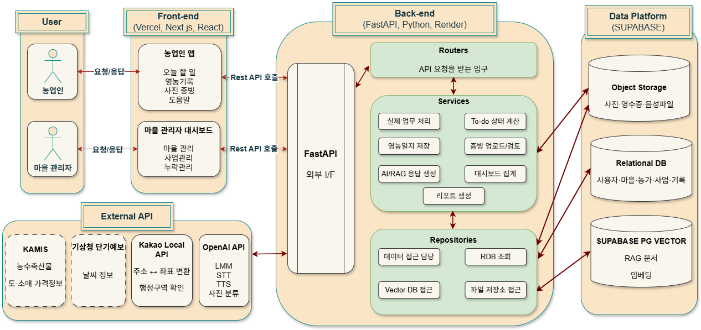

### 한눈 요약

| 영역 | 구성 | 비고 |
|---|---|---|
| **User** | 농업인 / 마을 관리자(이장) | 두 페르소나, 화면이 별도 |
| **Frontend** | Vercel + Next.js + React | `app_user` (농민용), `web_user` (이장용) 두 앱 |
| **Backend** | FastAPI + Python + Render | Routers → Services → Repositories 3계층 |
| **Data Platform** | Supabase | Object Storage(사진·영수증) / Relational DB(사용자·일지·증빙) / **pgvector(RAG, 운영중)** |
| **External API** | KAMIS / 기상청 / Kakao Local / OpenAI | 농수산물 가격, 날씨, 주소 변환, LLM/STT/TTS/Vision |

### 핵심 디자인 결정 (3가지)

1. **RDB 가 진실, AI 는 보조** — Todo·일지·증빙 같은 사실 데이터는 RDB. AI 는 입력 정제 / 답변 생성 / 안내 / 사진 코칭 역할에 한정. 직불금 컴플라이언스 도메인이라 AI 환각이 RDB 진실을 흔들면 안 됨.
2. **Storage / DBMS 중립화** — `STORAGE_MODE` (rdb/json) 와 `DB_SOURCE` (mysql/postgres) 두 변수로 의미 분리. repository 코드는 표준 SQL 만 사용해 양쪽 호환.
3. **벡터 DB 단일화 완료** — 옛 Chroma (로컬) → **Supabase pgvector 이전 완료** (2026-06-04). Relational + Vector 한 곳에서 운영하여 백업/스케일 관리 단순. 옛 Chroma DB 는 rollback 안전망으로 2주 보존.

---

## 2. 라이브 카메라 코칭 (촬영 전 실시간 가이드) — **신규 2026-06 / 최우선 시연**

증빙 사진의 품질은 직불금 통과율과 직결. 농민이 "어떻게 찍어야 하는지" 모르는 경우가 많아, 카메라가 켜진 순간부터 0.8초 간격으로 backend 가 사진을 평가해 가이드 문구를 실시간으로 띄우고 — 충분히 좋아지면 자동 셔터를 내림. 흔들림 감지 시 cancel.

`PHOTO_CRITERIA` × `JOB_EVIDENCE_TO_CRITERIA` 가 (job_cd, evidence_type) 별로 시행지침 9p 기준을 정의 (예: "배수물꼬 2주", "2~5cm 4회", "납품된 바이오차").

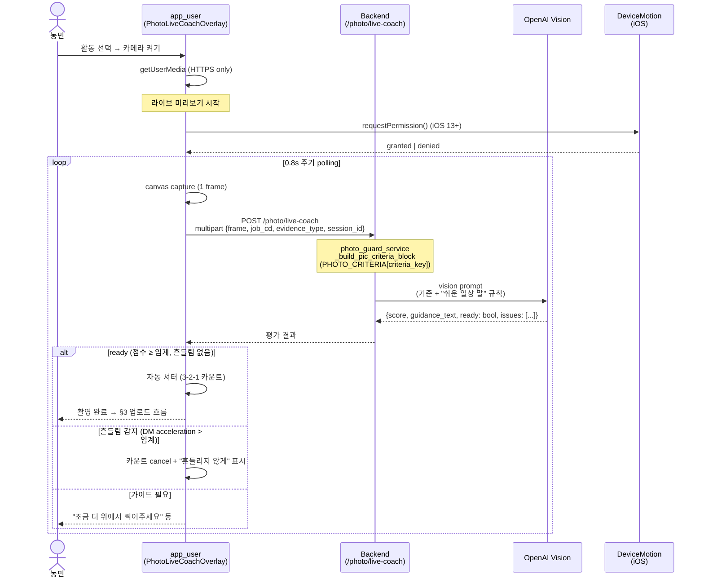

### 주요 의사결정

- **0.8초 polling** (SSE/WebSocket 아님): Render free plan + 농민 LTE 환경에서 안정성 우선. 1초 미만 응답 latency 가 vision API 비용 trade-off 와 균형.
- **자동 셔터 + 흔들림 cancel**: 농민이 "지금이 좋은 타이밍" 결정을 안 해도 됨. 흔들리면 자동 취소 → 흐릿한 사진 방지.
- **"쉬운 일상 말" prompt rule**: 시행지침은 전문 용어 ("배수물꼬", "2~5cm 4회", "경운"). 코칭 문구는 LLM 에 "어르신께 쉽게" 변환 강제 + 4가지 변환 예시 주입.
- **HTTPS-only 제약**: `getUserMedia` 는 브라우저 보안상 HTTPS / localhost 만. LAN 시연 시 Vercel 배포 + HTTPS URL 필수 ([known-limitations §1](../dev/known-limitations.md)).
- **세션 in-memory**: `session_id` 별 polling 상태가 backend in-memory dict. 다중 instance / 재시작 시 손실 — 시연용 OK, 정식 출시 시 Redis ([known-limitations §9](../dev/known-limitations.md)).

---

## 3. 증빙 업로드 + AI 라벨링 (라이브 코칭 후속)

사진을 찍으면 (라이브 코칭이 자동으로 셔터를 내리는 시점) OpenAI vision 이 "영수증인가 작업 사진인가" 분류 + `evidence_type` 별 기준 (`PHOTO_CRITERIA`) 합치 여부 + Pillow 가 GPS·시각·농민명 워터마크. 직불금 이행 점검 통과의 핵심.

> 사진 촬영 **전** 흐름 (라이브 코칭) 은 §2. 이 장은 셔터 이후 흐름.

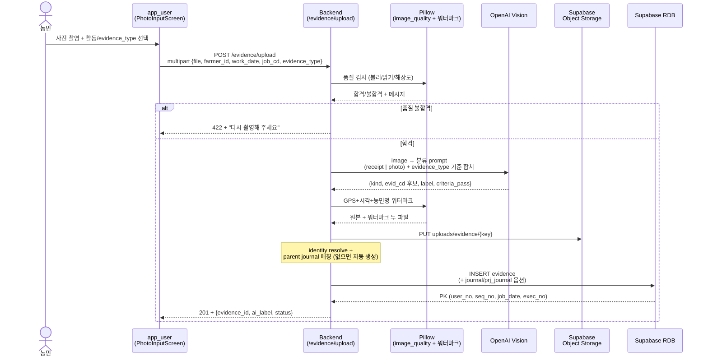

### 주요 의사결정

- **품질 검사 → vision → 워터마크 순서 고정**: 품질 불합격은 vision API 비용 낭비 없이 즉시 reject.
- **`raw_json` 컬럼에 status 보관**: 이장님 검토 결과(`pending`/`confirmed`/`rejected`) 가 evidence 테이블 스키마 변경 없이 들어감. 운영 변화 흡수 쉬움.
- **`PHOTO_CRITERIA` × `JOB_EVIDENCE_TO_CRITERIA` dict** (`photo_guard_service.py`): (job_cd, evidence_type) 조합별 시행지침 9p 기준이 hard-code. 표 데이터 RAG 추출 정확도 문제 회피 ([known-limitations §4](../dev/known-limitations.md)).

---

## 4. 영농일지 작성 (음성 → AI 정제 → DB)

또 다른 핵심 입력 흐름. 농민이 손에 흙 묻은 채 한 손으로 음성 녹음하면 LLM 이 정제해서 일지가 됨. 사업 작업과 자동 매칭되면 사업 일지로도 동시 저장.

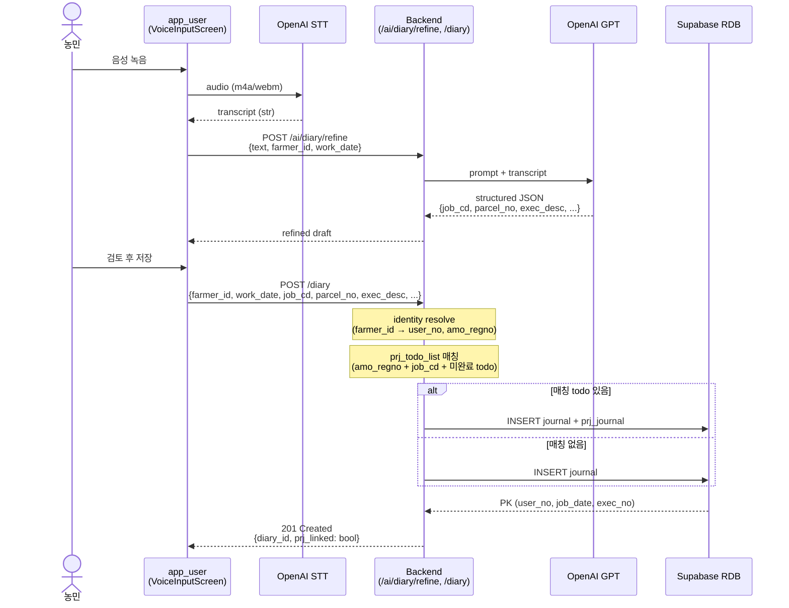

### 주요 의사결정

- **STT 는 frontend → OpenAI 직접** (backend 거치지 않음): 음성 파일이 backend 를 거치면 latency 두 배. 사용자 경험 우선.
- **사업 자동 매칭**: 동일 `amo_regno` + `job_cd` + 미완료 todo 가 있으면 `prj_journal` 동시 생성. 농민이 "이게 사업 작업인지" 고민할 필요 없음.

---

## 5. 이장 대시보드 — 오늘 먼저 챙길 일 (laggard top 3) — **신규 2026-06**

옛 마을주민 대시보드 (§11) 가 "전체 현황 통계" 였다면, 새 대시보드는 **"오늘 누구를 챙길지 알려주는 순서표"**. laggard top 3 가 메인 주인공, KPI 4개는 보조. AI 가 "오늘의 운영 메모" 한 줄 생성 + TTS 로 들어보기.

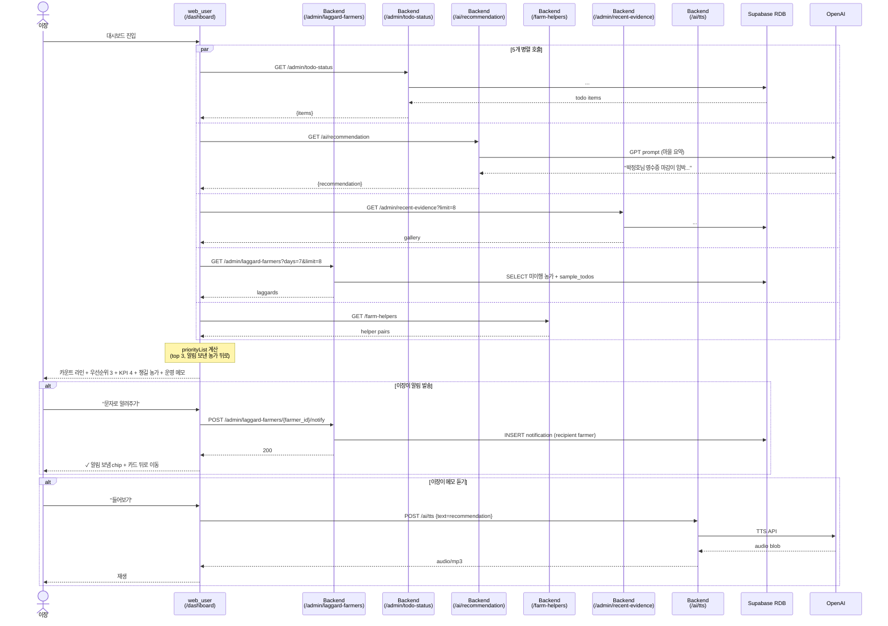

### 주요 의사결정

- **5개 병렬 fetch**: `Promise.race` 로 화면을 빨리 띄우고 나머지는 backgrounded. 농민 LTE 환경에서 체감 latency ↓.
- **laggard sort 룰**: 알림 보낸 농가는 뒤로 — "처리한 농가가 화면 위에 남지 않음" UX. 마감일 빠른 순 > 미이행 건수 많은 순.
- **운영 메모 안전망**: AI 추천 텍스트가 hero 농가/활동과 무관하면 fallback 한 줄 ("오늘은 마감이 가까운 활동부터…"). hero/메모 불일치 방지.
- **TTS fallback to Web Speech API**: OpenAI TTS 실패 시 브라우저 `speechSynthesis` 로 자동 대체 — 셀룰러 끊김 환경 대응.

---

## 6. RAG Q&A (질문 → intent 라우팅 → pgvector retrieve → 답변)

농민이 정책 질문하면 시행 문서(HWPX) chunk 를 retrieve 해서 농민 친근 어조로 답변. 질문 의도 자동 분류로 정확도 +α. **2026-06-04 부터 Supabase pgvector 운영**.

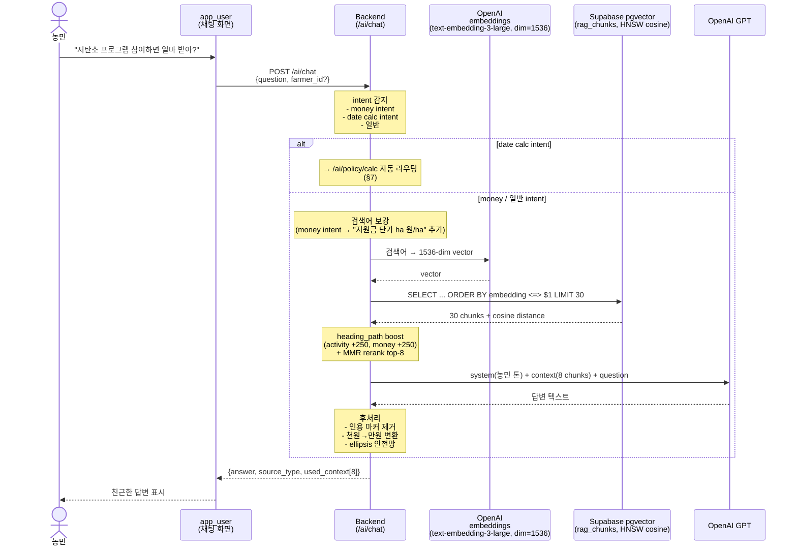

### 주요 의사결정

- **Intent 자동 분류 → 라우팅**: 날짜 계산 / 금액 / 일반 으로 분리해 각각 다른 prompt + retrieval 전략. 정확도 큰 차이 (예: 단가 질문 시 정답률 0 → 거의 100%).
- **dense embedding 외 keyword boost 병용**: 약어/고유명사("AWD", "바이오차") 가 dense 만으로는 약함. heading_path 토큰 매칭으로 강화.
- **Chroma → pgvector 이전 (2026-06-04)**:
  - `text-embedding-3-small` (1536) → **`text-embedding-3-large` + `dimensions=1536` 매개변수 native reduction** (HNSW 호환).
  - HNSW (cosine) index — 218 chunk 기준 평균 응답 385 ms.
  - `RAG_USE_PGVECTOR=0` env 로 옛 Chroma fallback (rollback 안전망, 2주 보존).
  - 10개 baseline 정확도 80% (5 명확 + 3 부분 + 2 부정확) — 시연 핵심 시나리오 모두 top-3 통과 ([known-limitations §4-A](../dev/known-limitations.md)).

---

## 7. 날짜 계산 자동 라우팅 (`/ai/policy/calc`)

농민이 "5월 27일 모내기 했어. 중간 물떼기 언제?" 처럼 구체 날짜 + 활동을 물으면 자동 감지해서 정밀 계산 endpoint 로 라우팅. 일반 RAG 답변보다 정확하고 단계별 추적 가능.

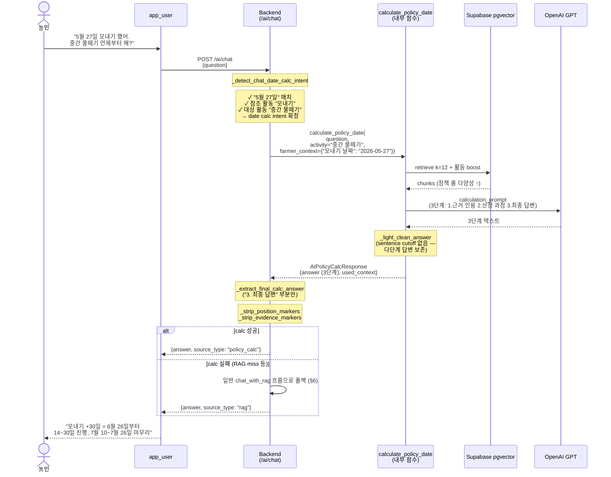

### 주요 의사결정

- **chat 내부 fallback 패턴**: calc 가 retrieve 실패하거나 LLM 응답이 비정상이면 일반 chat 으로 자동 폴백.
- **3단계 답변 → 최종 답변만 노출**: 디버깅 가치를 위해 3단계로 생성, 농민에겐 3번만 보임.

---

## 8. Todo 조회 + 상태 계산 (computed_status)

농민 홈 화면의 "오늘 할 일". RDB 의 todo + 일지/증빙 합산으로 진척 상태를 derived. **AI 가 절대 끼지 않는 곳** — 직불금 영향이라 진실은 RDB 만.

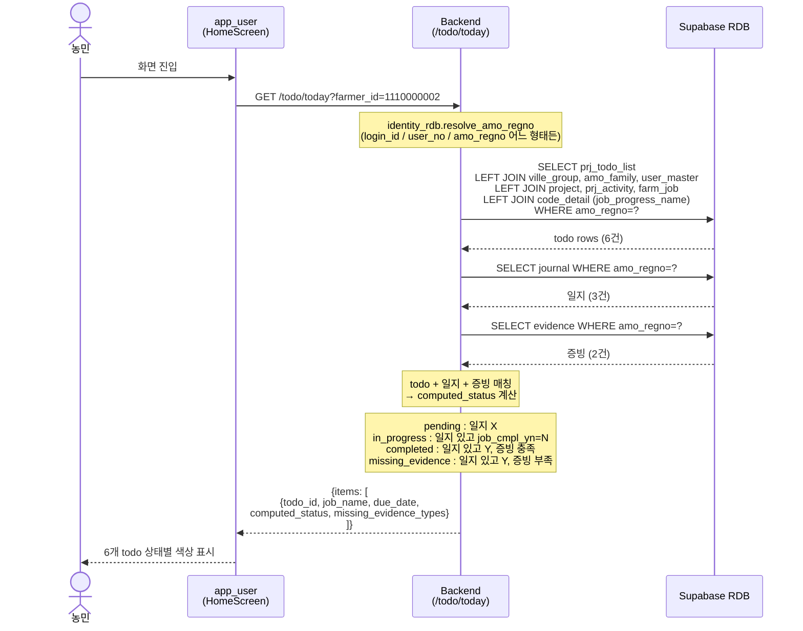

### 주요 의사결정

- **view 의존 제거 + raw JOIN (Phase C)**: 이전엔 `vw_jeotan_todo_board` view 호출. view DDL 동기화 부담 + DBMS 호환 이슈로 raw JOIN 으로 전환.
- **computed_status 는 backend 에서 derived**: RDB 컬럼으로 저장하지 않음. 일지/증빙 변경 시 자동 반영, 정합성 깨질 일 없음.

---

## 9. 농사 도와주기 (Helper ↔ Recipient 연결) — **신규 2026-06**

마을에는 디지털 기록이 어려운 어르신 농가가 있음. 같은 마을의 도와줄 농가가 어르신 대신 일지/증빙을 입력할 수 있도록 양쪽 동의 기반으로 연결. 입력된 일지/증빙은 **recipient** 의 user_no 로 저장 — 도우미는 매개체일 뿐.

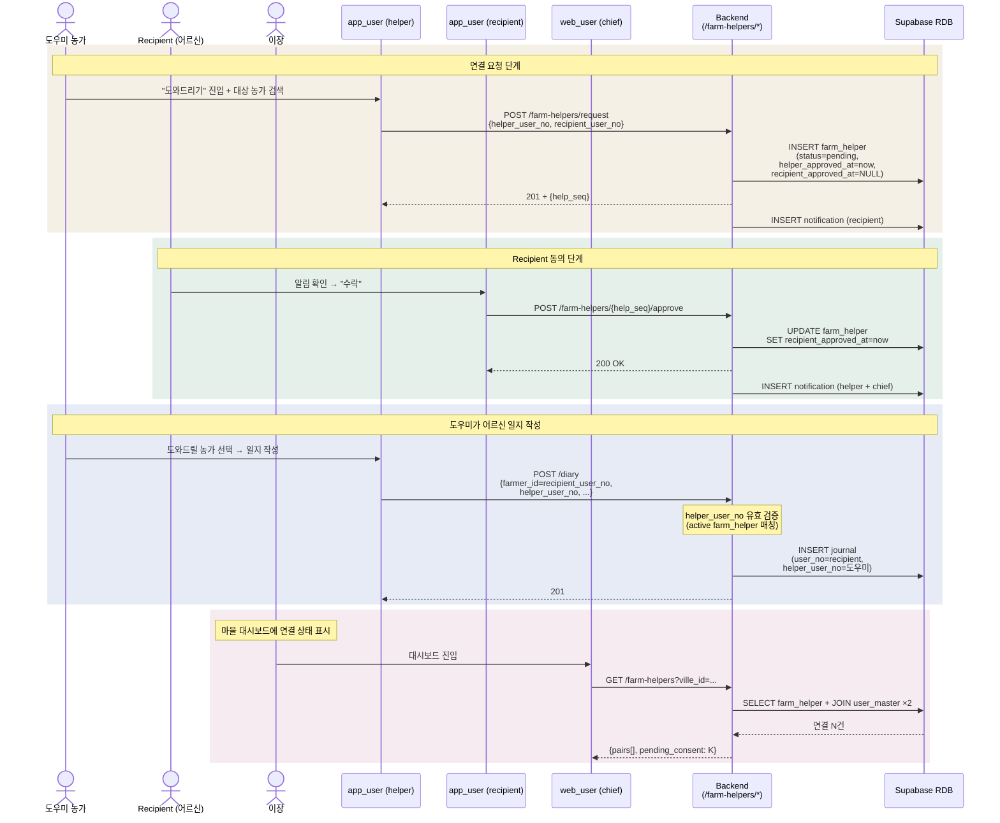

### 주요 의사결정

- **양쪽 동의 필수** (`helper_approved_at` + `recipient_approved_at`): 어르신 동의 없는 일방 입력 차단. 직불금 컴플라이언스 + 사회적 신뢰.
- **데이터 소유자는 recipient**: `journal.user_no = recipient`, `helper_user_no` 는 audit 컬럼. 일지/증빙 통계, 대시보드 모두 recipient 기준.
- **GPS 는 helper 폰 위치** (시연 한계): 워터마크 주소가 도우미 위치라 recipient 농가 위치와 다를 수 있음. 정식 출시 시 명시적 농가 선택 필요 ([known-limitations §6](../dev/known-limitations.md)).

---

## 10. 사업 참여 등록 + Todo 자동 생성 (관리자 흐름)

이장이 마을 그룹을 사업에 신청 → 활동별 농가 매핑 → 농가 × 작업 매트릭스의 `prj_todo_list` 가 일괄 생성. 농민 입장에선 "내 할 일이 자동으로 나타나는" 경험.

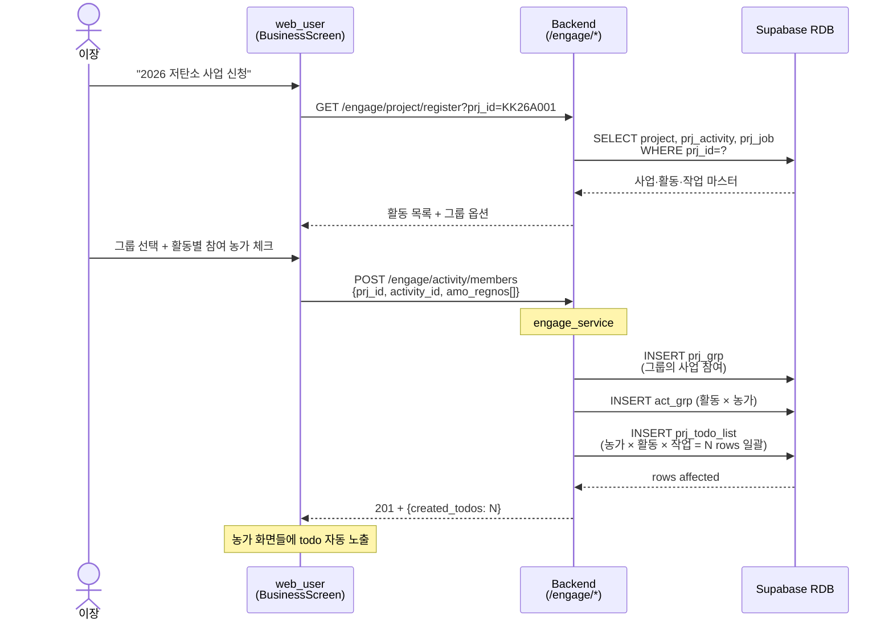

### 주요 의사결정

- **3 단계 hierarchy 분리**: `prj_grp`(그룹의 사업 참여) → `act_grp`(농가의 활동 참여) → `prj_todo_list`(농가 × 작업).
- **이장이 한 번 누르면 N rows 일괄 생성**: 농민 8명 × 활동 3종 × 작업 6단계 = 144 rows 까지 자동.

---

## 11. 마을주민 대시보드 (옛 admin/summary)

이장이 마을 전체 현황 한 화면에 본다. 농가별 일지/증빙 카운트, 진척률, 누락 등을 derived view.

> 새 이장 대시보드 (§5 "오늘 먼저 챙길 일") 가 시연/일상 운영용이라면, 이 화면은 통계 위주 — 점진적으로 §5 안으로 흡수 중.

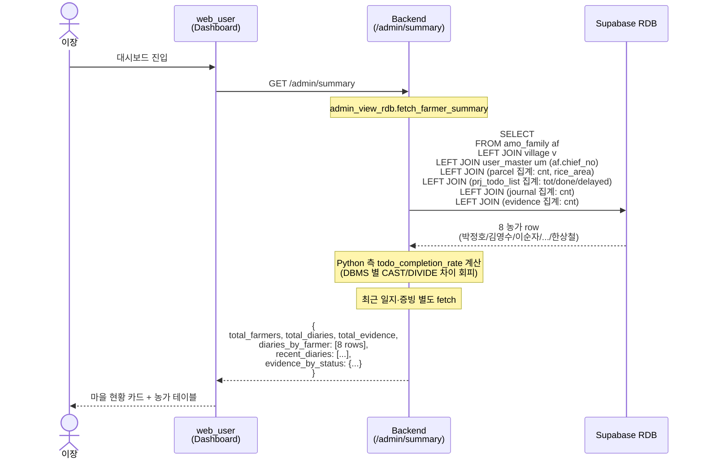

### 주요 의사결정

- **집계는 subquery LEFT JOIN**: view 없이도 한 SQL 로 8 농가 × (parcel + todo + journal + evidence) 합산.
- **나누기 (completion_rate) 는 Python**: SQL 은 분자/분모만, 계산은 Python.
- **derived cache 안 둠**: 일지가 진실 → 매번 derived. 정합성 깨질 일 없음.

---

## 12. DBMS 중립 (Storage / DB_SOURCE 분기)

서비스 코드는 mysql / postgres / JSON 어디로 가는지 몰라도 동일하게 동작. 환경변수 두 개 (`STORAGE_MODE` + `DB_SOURCE`) 가 런타임에 분기.

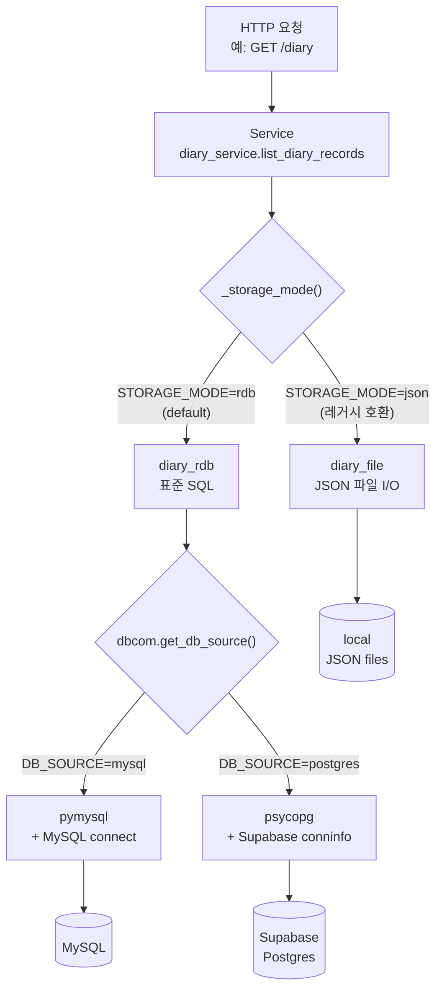

### 주요 의사결정

- **두 환경변수 의미 분리**:
  - `STORAGE_MODE` (`rdb` / `json`) — 어디에 저장? (storage 종류)
  - `DB_SOURCE` (`mysql` / `postgres`) — RDB 라면 어떤 DBMS? (DBMS 종류)
- **`dbcom` 단일 진입점**: 모든 SQL 실행이 `fetch_all` / `fetch_one` / `execute` / `executemany` / `transaction` 5개 함수만 거침. driver-specific 예외(`pymysql.MySQLError` / `psycopg.Error`)도 `DBExecutionError` 로 통일.
- **표준 SQL 만 사용**: 백틱 / `CURDATE()` / `INSERT IGNORE` 등 MySQL 전용 제거. repository 코드 안에 `if db_source == "mysql"` 분기 단 한 줄도 없음.

---

## 부록 A — 데이터/외부 의존 요약

| 의존 | 용도 | 비용/위험 |
|---|---|---|
| OpenAI STT (`gpt-4o-transcribe`) | 음성 → 텍스트 | 사용량 비례. frontend 직접 호출이라 backend 무관 |
| OpenAI GPT (`gpt-4o-mini`) | RAG 답변 / 일지 정제 / vision 분류 / 라이브 코칭 / 추천 | 라이브 코칭이 약간 큰 비용 — 0.8s polling 으로 농민당 분당 ~75 call |
| OpenAI Embeddings (`text-embedding-3-large`, dim=1536) | RAG 청크/쿼리 임베딩 | 1회 ingest $0.014 (218 chunks). 쿼리 시는 query embedding 만 |
| OpenAI TTS | 운영 메모 음성 | 사용량 비례, Web Speech fallback 으로 비용 절감 |
| Kakao Local | 주소 ↔ 좌표 | 무료 한도 충분 |
| 기상청 단기예보 | 날씨 정보 | 무료 OpenAPI |
| **Supabase pgvector** | RAG vectorstore (운영중) | rag_chunks 테이블 HNSW. Free tier 충분 |
| Supabase Storage | 사진/영수증 | bucket public 설정 필요 — Render fs fallback 운영 비권장 ([known-limitations §13](../dev/known-limitations.md)) |
| ~~Chroma~~ | ~~RAG vectorstore (옛)~~ | 2026-06-04 부로 pgvector 이전, 2주 보존 |

## 부록 B — 가이드 / 관련 문서

- [Backend 아키텍처 구성안](Backend_아키텍처_구성안.md)
- [DBMS 중립코드 작성·수정 가이드](../database/DBMS_중립코드_작성_수정_가이드.md)
- [Chroma vs Supabase pgvector 비교](../database/chroma-vs-supabase.md)
- [Dev Status 2026-06-04](../dev/dev-status-2026-06-04.md)
- [Known Limitations](../dev/known-limitations.md)
- [사업참여 ↔ 일지연계 분석](../business/사업참여_일지연계_분석.md)

## 부록 C — Figma 시각 자료 (멘토링 자리에서 띄울 큰 화면용)

> 멘토링 자리에서는 Mermaid 보다 Figma 의 큰 sequence diagram 이 시각적으로 잘 보임. 아래 link 는 핵심 흐름 3개를 FigJam 으로 생성한 것 — Pro plan "박찬호의 팀" 에 있음.
> 생성 일자: 2026-06-04.

| # | 흐름 | FigJam URL | 본문 |
|---|---|---|---|
| 1 | **사진 라이브 코칭** (자동 셔터 + 흔들림 감지) | https://www.figma.com/board/dtK0SrCzZilwjXitkFF8L1 | §2 |
| 2 | **증빙 업로드 + AI 라벨링** (라이브 코칭 후속) | https://www.figma.com/board/y9nw7ztxo2u4ZGTeNOWK0k | §3 |
| 3 | **RAG Q&A (Supabase pgvector)** | https://www.figma.com/board/d8XNKfCUZlHs13OAhmtfL0 | §6 |

> **사용 팁** — 시연 시 본문 Mermaid 옆에 같은 흐름 Figma 보드를 띄우면 청중이 큰 화면에서 한눈에 따라옴. Figma 측에서 더 정교한 스타일 (색·아이콘) 조정은 보드 열어서 직접 편집 가능.
