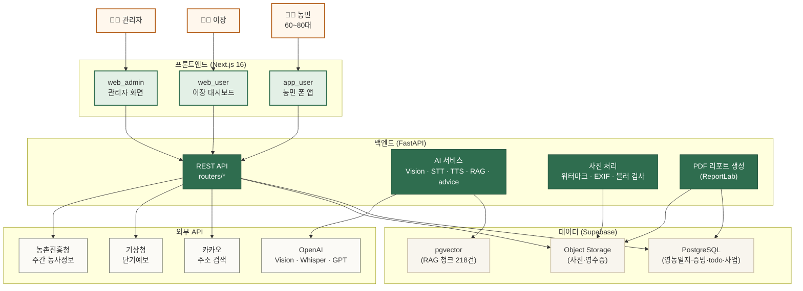
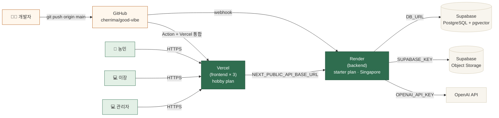
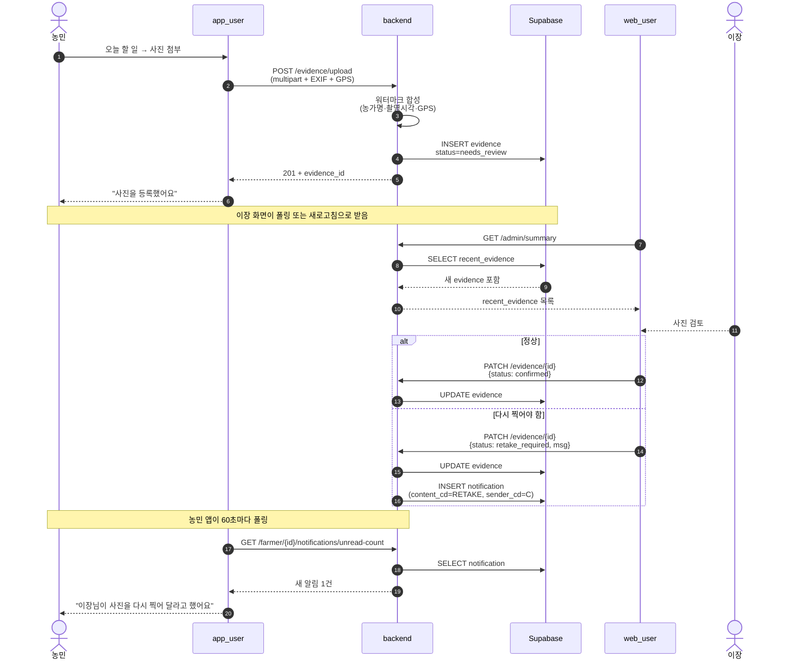
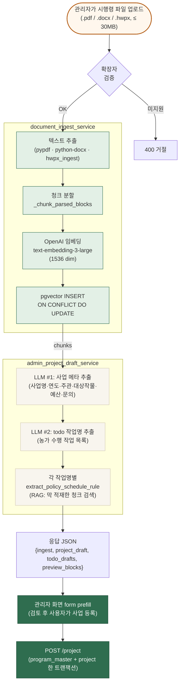
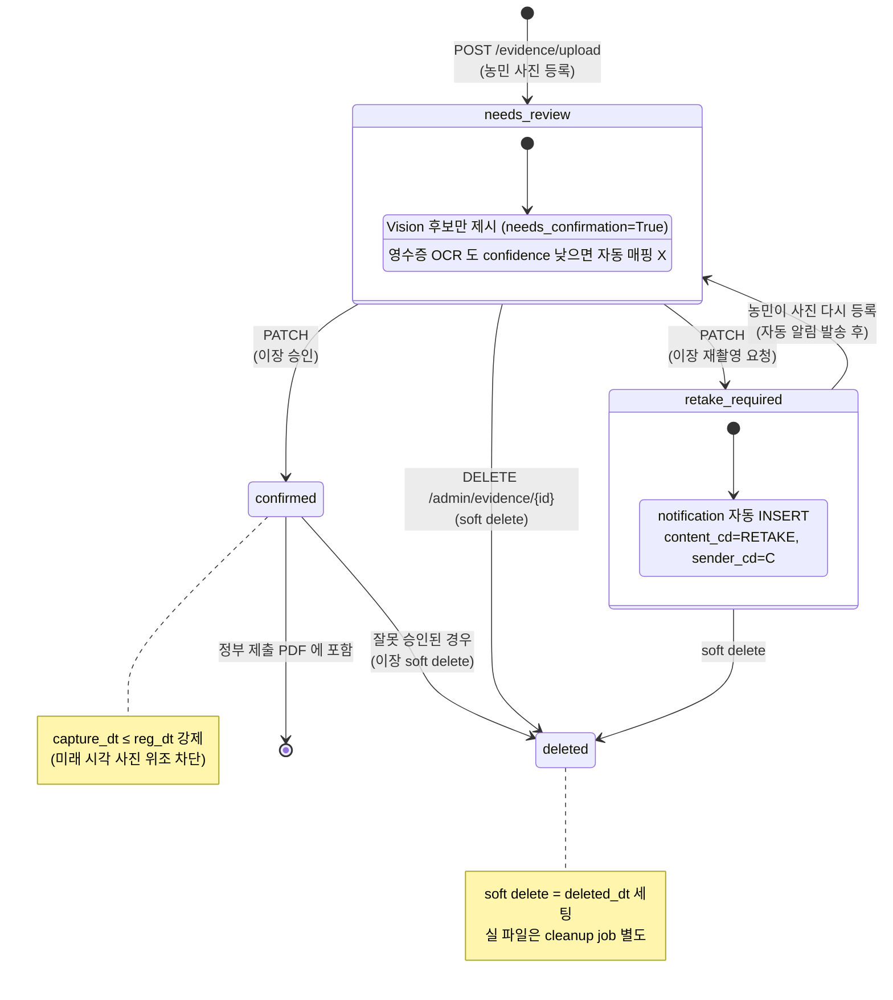
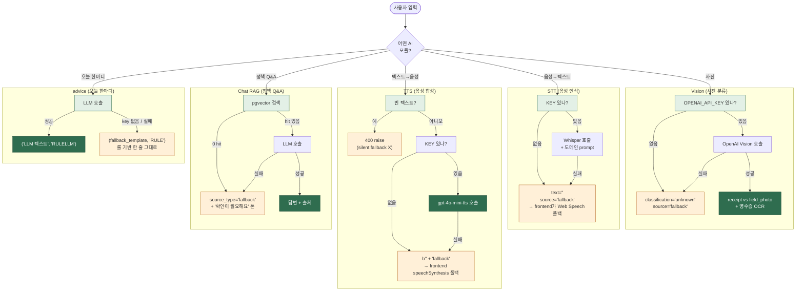
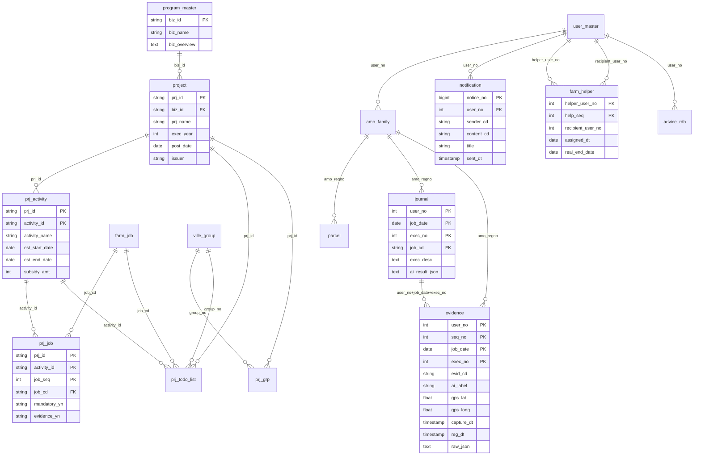
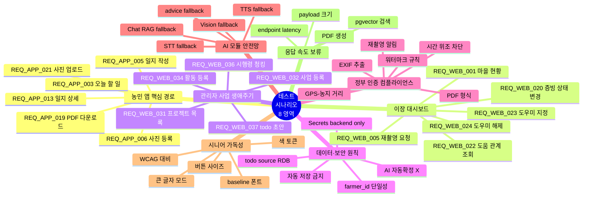

# 저탄마을 시각화 자료 모음

이 문서는 스프린트 4 까지 만든 시스템 구조와 사용자 흐름을 한눈에 볼 수 있도록 정리한 다이어그램 모음이다. 모든 그림은 Mermaid 로 그려서, GitHub 뷰어와 VS Code Markdown 미리보기에서 그대로 렌더링된다.

---

## 1. 어떤 다이어그램을 그릴지 고민한 흔적

처음에 고려한 후보는 열두 개였다.

| # | 후보 | 채택 여부 | 이유 |
|---|---|---|---|
| 1 | 시스템 아키텍처 (4 덩어리 + 외부 API) | ✅ | 평가자가 가장 먼저 보는 그림 |
| 2 | 배포 토폴로지 (GitHub → Render/Vercel/Supabase) | ✅ | 배포 보고서를 보완 |
| 3 | 3-앱 데이터 일관성 시퀀스 (농민 → 이장 → 알림) | ✅ | 시연 핵심 시나리오 |
| 4 | 시행령 자동 등록 흐름 (REQ_WEB_036/037) | ✅ | 스프린트 4 의 가장 큰 신규 |
| 5 | evidence 라이프사이클 상태도 | ✅ | 컴플라이언스 본질 |
| 6 | AI 모듈 fallback 체인 (5종) | ✅ | OpenAI 의존 graceful 검증 |
| 7 | DB 핵심 ERD (사업 → 활동 → Job → todo → 일지 → 증빙) | ✅ | 도메인 데이터 모델 |
| 8 | 테스트 시나리오 8 영역 마인드맵 | ✅ | 요구사항 ↔ 테스트 매핑 시각화 |
| 9 | 도우미 모드 페어 흐름 | 보류 | 시퀀스 3 과 비슷, 분량 |
| 10 | RAG 검색 단독 흐름 | 보류 | 시행령 흐름 4 안에 포함 |
| 11 | 음성 영농일지 세션 흐름 | 보류 | "자동 저장 금지" 는 상태도 5 로 충분 |
| 12 | 사용자 페르소나 × 화면 매트릭스 | 보류 | 시각화보다 표가 더 명확 |

최종 8개를 골랐다. 보류한 4개는 같은 의도를 다른 그림이 이미 다루거나, 표 형태가 더 명확하기 때문이다.

---

## 2. 시스템 아키텍처 — 무엇이 어디에 있고 무엇을 한다

저탄마을의 네 덩어리와 그 사이의 데이터 흐름이다. 평가자가 첫 페이지로 보면 좋다.

---

## 3. 배포 토폴로지 — GitHub 에서 운영까지

main 브랜치에 push 가 들어왔을 때 backend 와 frontend 가 어떻게 동시에 다시 띄워지는지의 그림이다. 배포 보고서 §3 을 시각으로 보완한다.

---

## 4. 농민 → 이장 → 알림 — 시연의 핵심 시나리오

농민이 사진 한 장을 올리면 이장 화면에 즉시 보이고, 이장이 검토 결과를 보내면 농민에게 알림이 자동으로 간다. 저탄마을의 가치가 가장 압축된 흐름이다. L3 e2e 테스트가 이 시퀀스를 자동으로 검증한다.

---

## 5. 시행령 자동 등록 — 스프린트 4 의 가장 큰 신규 기능

관리자가 정부 시행령 (.pdf / .docx / .hwpx) 한 장을 업로드하면, backend 가 청크화·임베딩·LLM 추출까지 한 endpoint 로 끝낸다. REQ_WEB_036·037 의 흐름이다.

---

## 6. evidence 라이프사이클 — 컴플라이언스의 본질

농민이 올린 사진 한 장이 처음 등록될 때부터 정부 제출용 PDF 에 들어갈 때까지의 상태 변화. 자동 확정이 없는 점, 재촬영 흐름, soft delete 가 한 그림에 들어 있다.

---

## 7. AI 모듈 fallback 체인 — OpenAI 가 꺼져도

저탄마을의 5개 AI 모듈은 모두 OpenAI 에 의존하지만, 키가 만료되거나 API 가 응답하지 않을 때를 위한 안전한 fallback 경로를 갖고 있다. L5 검증 영역이 이 그림이다.

---

## 8. 도메인 데이터 모델 (핵심 ERD)

저탄마을의 도메인이 어떻게 데이터로 표현되어 있는지의 그림. 매핑 표 §1 의 요구사항이 실제로 어느 테이블을 건드리는지 추적할 때 같이 본다.

---

## 9. 테스트 시나리오 8 영역 — 요구사항이 어디로 흩어지나

요구사항 67건이 자동 테스트의 8 영역으로 어떻게 흩어져 들어가는지의 그림이다. 매핑 표를 시각으로 보완한다.

---

## 10. 다이어그램 활용 가이드

각 다이어그램이 어디서 가장 도움 되는지의 매핑.

| 다이어그램 | 누가 / 언제 |
|---|---|
| 시스템 아키텍처 | 평가·심사 첫 페이지 / 신규 인수 진입 / 외부 발표 |
| 배포 토폴로지 | DevOps 인수 / 비용 검토 / 운영 권한 이전 시 |
| 농민 → 이장 → 알림 시퀀스 | 시연 시나리오 설명 / e2e 테스트 작성 시 |
| 시행령 자동 등록 흐름 | 관리자 화면 PM 인계 / RAG 동작 설명 |
| evidence 라이프사이클 | 컴플라이언스 설명 / 정부 감사 대응 / status 코드 추가 시 |
| AI 모듈 fallback | 운영 사고 대응 매뉴얼 / 신규 AI 모듈 추가 시 |
| 도메인 ERD | 신규 backend 개발자 인계 / 새 쿼리 작성 / DB 마이그 계획 |
| 8 영역 마인드맵 | 평가·심사 단일 슬라이드 / 새 요구사항이 어느 영역에 들어갈지 분류 |

---

## 11. 추가 검토

위 8 개로 충분하지 않은 경우 다음을 더 그릴 수 있다.

- **도우미 모드 상태 전이** — 페어 배정 → 양쪽 동의 대기 → 활성 → 해제 까지의 state diagram
- **음성 영농일지 세션** — start → reply (최대 3턴) → finalize → POST /diary 까지의 시퀀스, "자동 저장 금지" invariant 시각화
- **사용자 권한 매트릭스** — 농민·이장·관리자·도우미 각각이 접근 가능한 API 와 화면의 표
- **RAG 검색 흐름 (단독)** — 사용자 질문 → embedding → pgvector + boost + MMR → LLM → 응답
- **PDF 리포트 생성 흐름** — todo + 일지 + 증빙 모음 → ReportLab → 한글 폰트 → 페이지 footer
- **시드 데이터 ER** — 데모 농가 7명 × 사업 × 활동 × 일지 × 증빙의 cross product (시연 데이터 사전 점검용)
