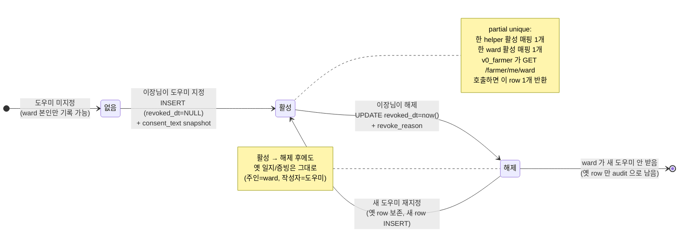
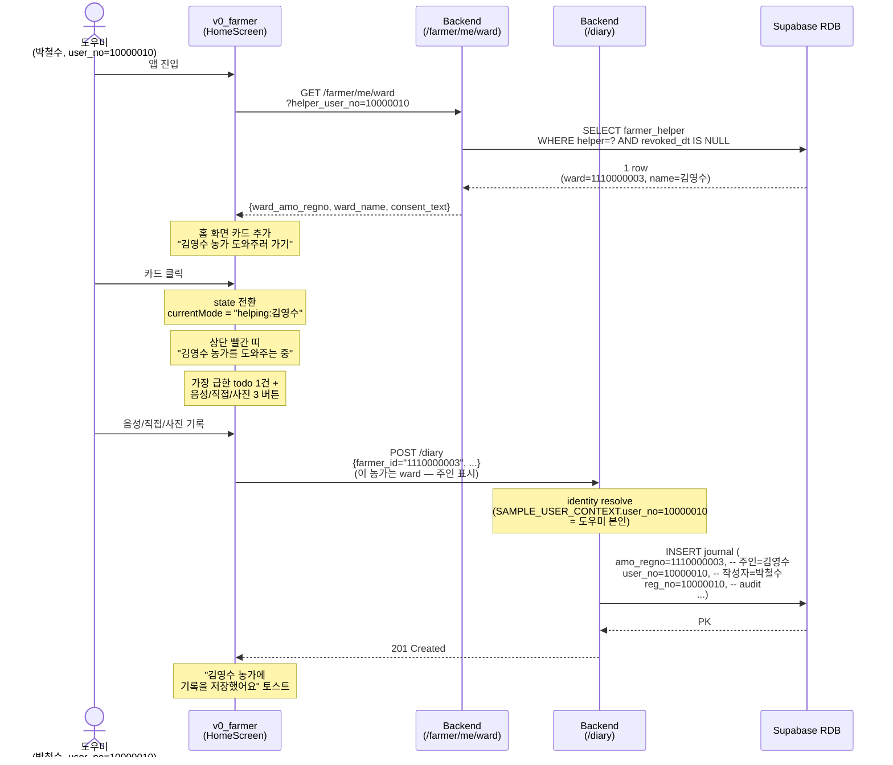
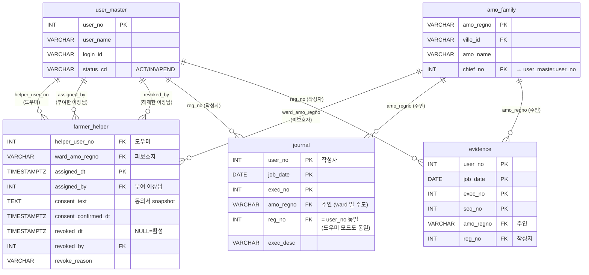

# farmer_helper 테이블 신설 — DBA 협의 요청

## 1. 배경 / 목적

**고령(75+) 농가가 영농 기록을 직접 못 쓰는 케이스를 위해**, 같은 마을의 다른 농가 1명에게
대리 기록 권한을 부여하는 1:1 매핑 테이블.

### 운영 규칙
- **이장님만 권한 부여/해제** 가능 (자동 매칭 X — 마을 신뢰 기반)
- **엄격한 1:1**: 한 도우미는 한 명만 도울 수 있고, 한 피보호자(ward)도 한 명의 도우미만 받음
- **시스템 내 전자 동의** — 이장님이 동의서 본문 입력 + "농가 동의 확인" 체크 후 저장
  - 종이 동의서 별도 보관 X (시스템 row 가 권한 증거)
- **권한 해제 = 새 기록 못 함**. 그동안 도우미가 쓴 옛 기록은 그대로 보존
- audit log: 기존 `journal/evidence.reg_no` (실제 기록자) + `amo_regno` (주인) 로 이미 분리 추적 가능

### 처리 대상 (구현 후)
- v0_farmer 홈 화면에 "박○○ 농가 도와주러 가기" 카드 (활성 매핑 있을 때만)
- "도와주는 중" 모드: 상단 빨간 띠 + 그 ward 의 가장 급한 todo 1건 + 음성/직접/사진 3 버튼
- v0_chief residents 화면에 농가별 "도우미 지정/변경/해제" 버튼

---

## 2. 제안 DDL (PostgreSQL)

```sql
CREATE TABLE farmer_helper (
  -- 자연 PK = (helper, ward, assigned_dt) — 한 도우미가 같은 ward 를 여러 번
  -- 지정/해제/재지정해도 row 가 누적 (audit log 보존)
  helper_user_no    INTEGER       NOT NULL,
  ward_amo_regno    VARCHAR(32)   NOT NULL,
  assigned_dt       TIMESTAMPTZ   NOT NULL DEFAULT now(),

  -- 부여한 이장님 user_no
  assigned_by       INTEGER       NOT NULL,

  -- 시스템 내 전자 동의 내용
  -- 이장님이 입력한 동의서 본문 (snapshot — 본문 양식이 추후 바뀌어도 row 의 본문은 보존)
  consent_text      TEXT          NOT NULL,
  -- 이장님이 "농가가 직접 동의함" 체크한 시각 (consent_text 와 함께 효력 증거)
  consent_confirmed_dt  TIMESTAMPTZ   NOT NULL DEFAULT now(),

  -- 해제 시각. NULL = 활성, 값 있으면 해제됨 (옛 row 는 영원히 보존)
  revoked_dt        TIMESTAMPTZ   NULL,
  revoked_by        INTEGER       NULL,   -- 해제한 이장님 user_no
  revoke_reason     VARCHAR(255)  NULL,   -- 해제 사유 (옵션)

  -- audit
  reg_dt            TIMESTAMPTZ   NOT NULL DEFAULT now(),
  reg_no            INTEGER       NULL,
  mod_dt            TIMESTAMPTZ   NULL,
  mod_no            INTEGER       NULL,

  CONSTRAINT pk_farmer_helper PRIMARY KEY (helper_user_no, ward_amo_regno, assigned_dt)
);

-- 1:1 활성 제약 (partial unique — 활성 매핑만)
CREATE UNIQUE INDEX uq_farmer_helper_active_helper
  ON farmer_helper (helper_user_no)
  WHERE revoked_dt IS NULL;

CREATE UNIQUE INDEX uq_farmer_helper_active_ward
  ON farmer_helper (ward_amo_regno)
  WHERE revoked_dt IS NULL;

-- 이장님 view 용 — 마을의 모든 활성 매핑 시간순 조회
CREATE INDEX idx_farmer_helper_recent
  ON farmer_helper (assigned_by, assigned_dt DESC)
  WHERE revoked_dt IS NULL;
```

---

## 3. 컬럼 설명

| 컬럼 | 타입 | 설명 |
|---|---|---|
| `helper_user_no` | INTEGER | 도우미 (실제 기록자) user_master.user_no |
| `ward_amo_regno` | VARCHAR(32) | 피보호자 (도움 받는 농가) amo_family.amo_regno |
| `assigned_dt` | TIMESTAMPTZ | 권한 부여 시각 (PK 일부 — 재지정 audit) |
| `assigned_by` | INTEGER | 부여한 이장님 user_no |
| `consent_text` | TEXT | 동의서 본문 snapshot (양식 변경 후에도 row 의 본문 보존) |
| `consent_confirmed_dt` | TIMESTAMPTZ | "농가 직접 동의" 체크 시각 — 효력의 증거 |
| `revoked_dt` | TIMESTAMPTZ | NULL = 활성. 값 있으면 해제됨 (row 영구 보존) |
| `revoked_by` | INTEGER | 해제한 이장님 user_no |
| `revoke_reason` | VARCHAR | 해제 사유 (옵션 — "도우미 이사" 등) |
| `reg_*` / `mod_*` | audit | 시드 컨벤션 일치 |

### 1:1 제약 의미
- partial unique `uq_farmer_helper_active_helper`: 한 도우미는 활성 매핑 1개만 가능
- partial unique `uq_farmer_helper_active_ward`: 한 ward 는 활성 매핑 1개만 가능
- 해제(revoked_dt 채움) 후 재지정 가능 (옛 row 영구 보존 + 새 row INSERT)

---

## 4. backend 가 사용할 쿼리 예시

### 4-1. 도우미 지정 (이장님 액션)
```sql
INSERT INTO farmer_helper
  (helper_user_no, ward_amo_regno, assigned_dt, assigned_by,
   consent_text, consent_confirmed_dt, reg_dt, reg_no)
VALUES (%s, %s, now(), %s, %s, now(), now(), %s);
-- 1:1 unique 위반 시 23505 SQLSTATE → backend 409 Conflict 반환.
```

### 4-2. 본인이 도와줄 ward 정보 (v0_farmer 가 호출)
```sql
SELECT fh.ward_amo_regno, af.amo_name, fh.assigned_dt, fh.consent_text
FROM farmer_helper fh
JOIN amo_family af ON af.amo_regno = fh.ward_amo_regno
WHERE fh.helper_user_no = %s
  AND fh.revoked_dt IS NULL
LIMIT 1;
```

### 4-3. 마을 전체 활성 매핑 list (이장님 view)
```sql
SELECT
  fh.helper_user_no,  hu.user_name AS helper_name,
  fh.ward_amo_regno,  af.amo_name  AS ward_name,
  fh.assigned_dt,     fh.assigned_by
FROM farmer_helper fh
JOIN user_master hu ON hu.user_no = fh.helper_user_no
JOIN amo_family af ON af.amo_regno = fh.ward_amo_regno
WHERE fh.revoked_dt IS NULL
ORDER BY fh.assigned_dt DESC;
```

### 4-4. 권한 해제 (이장님 액션)
```sql
UPDATE farmer_helper
SET revoked_dt = now(),
    revoked_by = %s,
    revoke_reason = %s,
    mod_dt = now(),
    mod_no = %s
WHERE helper_user_no = %s
  AND ward_amo_regno = %s
  AND revoked_dt IS NULL;
```

### 4-5. 농가별 매핑 이력 (audit 조회)
```sql
SELECT helper_user_no, ward_amo_regno,
       assigned_dt, revoked_dt, assigned_by, revoked_by, revoke_reason
FROM farmer_helper
WHERE ward_amo_regno = %s OR helper_user_no = %s
ORDER BY assigned_dt DESC;
```

---

## 5. 사용 시나리오 (data 예시)

### 시나리오 A — 이장님이 김영수(78세) 의 도우미로 박철수(45세) 지정
```
INSERT INTO farmer_helper VALUES (
  10000010,  -- 박철수 user_no
  '1110000003',  -- 김영수 amo_regno
  now(),
  10000001,  -- 이장님 user_no
  '본인은 박철수에게 영농기록 작성을 위임하며 ...',  -- 동의서 본문
  now(),  -- 이장님 확인 시각
  now(), 10000001
);
```

### 시나리오 B — 도우미 박철수가 v0_farmer 열면
1. mount 시 `GET /farmer/me/ward?helper_user_no=10000010`
2. 응답: `{ward_amo_regno: "1110000003", ward_name: "김영수 농가"}`
3. 홈 화면에 "김영수 농가 도와주러 가기" 카드 노출
4. 클릭 → 모드 전환 → 상단 "김영수 농가를 도와주는 중" 빨간 띠
5. 박철수가 기록하면:
   - `POST /diary` (farmer_id="1110000003", reg_no=10000010)
   - row: 주인=김영수, 작성자=박철수 (기존 `reg_no` 컬럼으로 audit 자연 분리)

### 시나리오 C — 이장님이 권한 해제
```
UPDATE farmer_helper SET revoked_dt = now(), revoked_by = 10000001
  WHERE helper_user_no = 10000010 AND revoked_dt IS NULL;
```
→ 박철수 홈 화면 새로고침 시 "김영수 도와주러 가기" 카드 사라짐 (active row 없음).
→ 옛 기록 (박철수가 김영수 대신 쓴 것) 은 그대로 (주인=김영수). 옛 row 의 revoked_dt 도 보존.

### 시나리오 D — 박철수가 이사 후 새 도우미 지정
1. 이장님이 박철수 권한 해제 (시나리오 C)
2. 이장님이 김민수 (다른 농가) 를 김영수 도우미로 새로 지정 → 새 row INSERT 성공
3. 옛 row 와 새 row 둘 다 DB 에 보존. partial unique 는 활성(revoked_dt IS NULL) 1개만 강제.

---

## 6. 운영 정책 제안

| 항목 | 제안 |
|---|---|
| **권한 변경 빈도** | 한 농가 기준 월 1회 정도 가정. partial unique 충돌은 의도된 정책 (이전 해제 안 하면 새 지정 불가) |
| **데이터 보존** | 영구 (`revoked_dt` 만 채움). 시범사업 종료 후 정산/감사 audit 용 |
| **개인정보** | `consent_text` 안에 농가 본명 외 민감 정보 X (전화번호·주민번호 X) |
| **권한 부여 시점 확인** | backend 가 INSERT 시 helper/ward 둘 다 같은 ville_id 인지 검증 (다른 마을 도우미 금지) |
| **권한** | INSERT/UPDATE — 이장님(chief) 만. SELECT — 본인 매핑 + 이장님 전체 |

---

## 7. 마이그레이션 영향도

- **신규 테이블만 추가** — 기존 row / schema 변경 0
- 기존 `journal/evidence.reg_no` audit 컬럼 그대로 활용 (도우미 모드에서 reg_no = 도우미 user_no)
- 인덱스 3개 (partial unique 2 + 시간순 1)
- 시퀀스 불필요 (자연 PK)

DBA 측 작업: 위 DDL 실행 → 끝. 데이터 마이그레이션 없음.

---

## 8. 구현 plan (DBA 승인 후)

| Step | 영역 | 산출물 | 크기 |
|---|---|---|---|
| 1 | backend | `farmer_helper_rdb.py` (CRUD + ville_id 검증) | 작음 |
| 2 | backend | `farmer_helper_service.py` + 4 endpoint (`GET /admin/helpers`, `POST /admin/helpers`, `DELETE /admin/helpers/{...}`, `GET /farmer/me/ward`) | 작음 |
| 3 | v0_chief | residents 화면 농가 행에 "도우미 지정/변경/해제" 버튼 + 동의서 모달 | 중 |
| 4 | v0_farmer | HomeScreen 에 ward 카드 추가 (활성 매핑 있을 때만) | 작음 |
| 5 | v0_farmer | "도와주는 중" 모드 — 헤더 빨간 띠 + ward 의 todo 1건 + 음성/직접/사진 3 버튼만 | 중 |
| 6 | v0_farmer | 기록 시 `farmer_id` 자동 ward 것으로 (reg_no = SAMPLE_USER_CONTEXT.user_no 그대로) | 작음 |

총 2-3일 작업 (frontend 가 큰 부분).

DBA 승인 주시면 Step 1 부터 시작합니다.

---

## 9. 다이어그램

### 9-1. 매핑 라이프사이클 (state)

권한이 생성·사용·해제·재지정 되는 전체 상태 흐름. partial unique 두 개로 "활성 1:1" 만 강제 — 옛 row 는 영구 보존.



#### 주요 의사결정

- **`revoked_dt` 만으로 활성/비활성 구분** — `is_active` boolean 같은 cache 컬럼 X. 시각 = 시점 + 활성여부 합쳐서 의미. timestamp 가 진실.
- **재지정 시 새 row INSERT** — 같은 helper × ward 가 해제 후 다시 지정될 수도 있으니 자연 PK `(helper, ward, assigned_dt)` 로 row 누적. 옛 동의서 본문도 보존 → 향후 감사 시점에 "그 때 어떤 동의서로 권한이 부여됐는지" 추적 가능.

---

### 9-2. 도우미가 ward 대신 일지 작성 (sequence)

핵심 use case. v0_farmer 의 mode switching + 기존 `journal.reg_no` audit 컬럼을 그대로 활용해 별도 audit 테이블 없이 "주인 vs 작성자" 분리.



#### 주요 의사결정

- **audit 별도 테이블 불필요** — 기존 `journal.reg_no` / `evidence.reg_no` 가 "실제 INSERT 한 user_no" 를 이미 보존. 도우미가 쓴 row 는 `(amo_regno=ward, reg_no=도우미)` 로 자연스럽게 audit 분리. 새 `recorded_by` 컬럼 추가 필요 X.
- **frontend mode state 만으로 처리** — backend 는 어차피 form 의 `farmer_id` 를 신뢰. 도우미 모드면 frontend 가 `farmer_id` 만 ward 것으로 보냄. 도우미 권한 검증은 frontend 가 카드 노출 시점에 이미 함 (`/farmer/me/ward` 응답에 ward 있으면 권한 있음).
- **상단 빨간 띠 — 데이터 출처 매 순간 인지** — UX 핵심. "내가 지금 김영수 농가 기록을 쓰고 있다" 가 화면에서 사라지면 실수로 본인 기록과 섞일 위험. 띠 + "돌아가기" 버튼이 모드 종료 명확.

---

### 9-3. 테이블 관계 (ER)

`farmer_helper` 가 기존 master 테이블 4개와 어떻게 연결되는지. journal/evidence 의 `reg_no` 가 자연스러운 audit 분리 역할을 함을 보여줌.



#### 주요 의사결정

- **`farmer_helper` 는 4 개 외래키 모두 `user_master` / `amo_family` 만 참조** — 별도 master 신설 없이 기존 신원 테이블 재사용.
- **journal/evidence 의 `reg_no` = `user_no` 와 동일 도메인** — 도우미 모드든 본인 모드든 row 의 `(amo_regno, reg_no)` 한 쌍으로 "주인 vs 작성자" 가 완성. 별도 `recorded_by_helper_id` 같은 컬럼 도입 불필요 — 가이드의 "스키마 변경 최소화" 정신 정합.
- **`consent_text` 는 row 안에 snapshot 으로 저장** — 양식이 추후 바뀌어도 해당 row 의 동의서 본문은 그 시점 그대로 보존. 감사 시 "그 때 그 농가는 어떤 약관에 동의했는가" 가 row 1개로 답변 가능.

---

## 부록 — 관련 문서

- [notification 테이블 신설 spec](notification-table-spec.md) — 알림 통합 (같이 DBA 협의)
- [멘토링 자료 — 서비스 아키텍처](../../docs/멘토링_서비스_아키텍처.md) — 전체 시스템 컨텍스트
- [Backend 아키텍처 구성안](../../docs/Backend_아키텍처_구성안.md)

